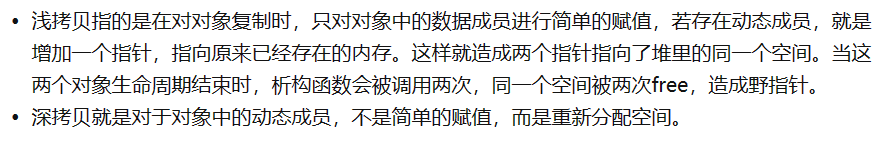

# C++

## 基础

- 静态成员变量在编译阶段分配内存，程序运行前没有分配内存；类内声明，类外初始化，必须有初始值

## 特性

- 三大特性：封装/继承/多态

## 深拷贝和浅拷贝

- 

## 构造函数

- 无参构造/一般构造/复制构造

## this指针

- this指针本质上是指针常量，指针的指向不可以修改
- 作用：
  - 解决名称冲突
  - 返回对象本身用\*this

