1. 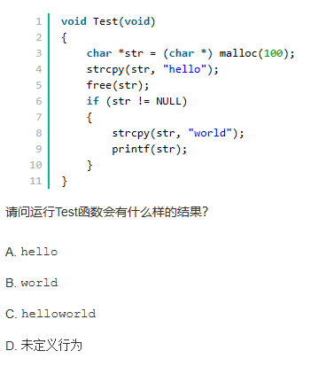

   - free(str)只是释放了str指针所指向的内存区域，并未修改指针本身的地址值，所以str!=NULL,但是str是一个野指针（野指针 指向一个已删除的对象或未申请访问受限内存区域的指针），访问内存区域是受限的

2. 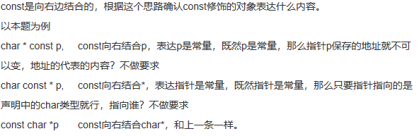

3. 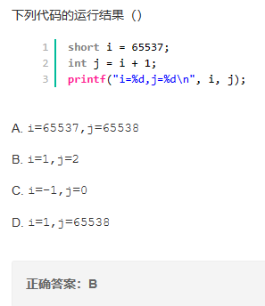

   - 首先说明，short类型的表示范围是 -32768 ~ + 32767，65537用int表示，为0000 0000 0000 0001 0000 0000 0000 0001，转化为short的时候高两位字节丢失，于是变成1，求j的值是再将i转化为int类型，高位两位字节补0，所以i没有变化，j的值为2。

4. 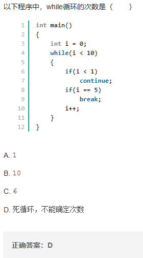

5. 不能被重载的运算符 1、. (成员访问运算符) 2、.* (成员指针访问运算符) 3、:: (域运算符) 4、sizeof(长度运算符) 5、?: (条件运算符）

6. 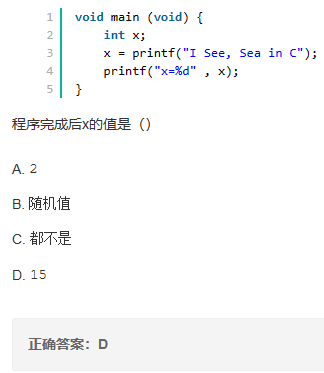

   - printf返回字符串长度，不包含\\0,\\n

7. 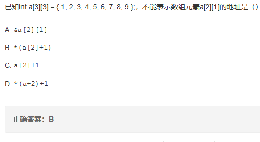

8. 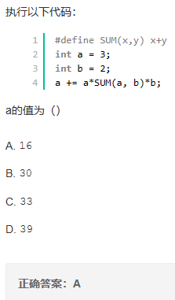

   - \#define SUM(x,y) x+y 这是在定义宏 宏不仅替换字符串 还替换参数列表

     原式a=a+a*SUM(a,b)*b=a+a*a+b*b=16

9. 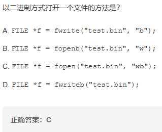
10. 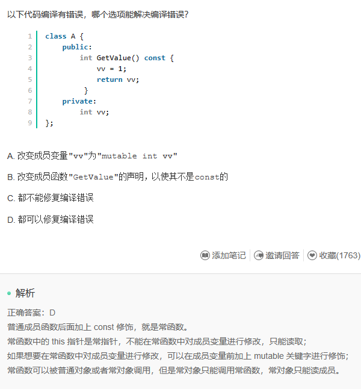

11. 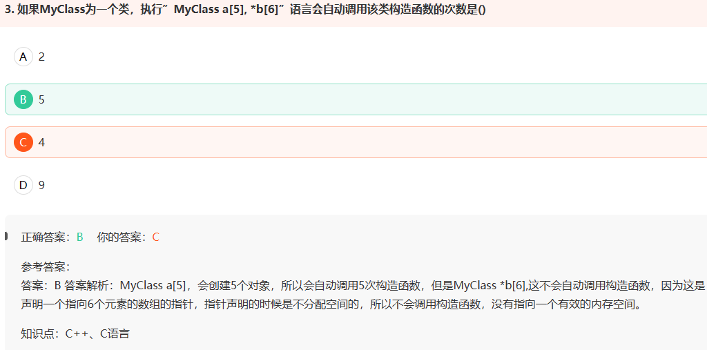

12. 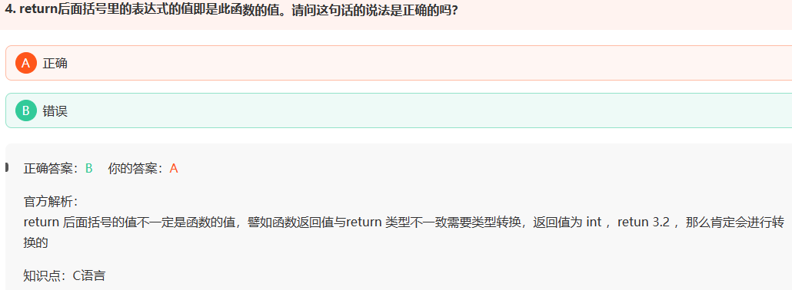

13. 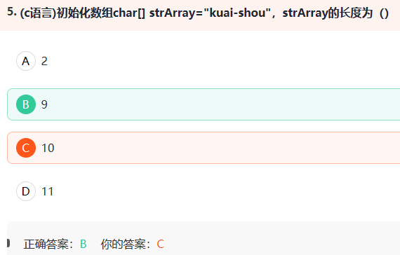

    - 长度为9，大小（sizeof）为10

14. 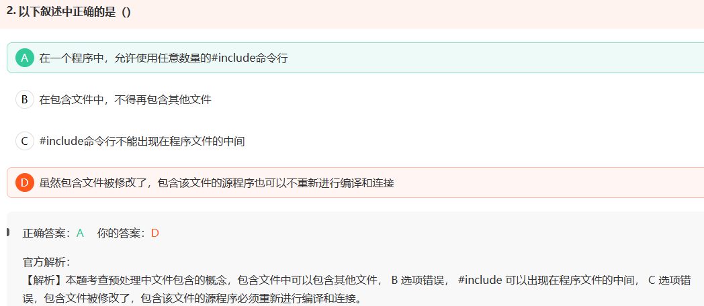

15. 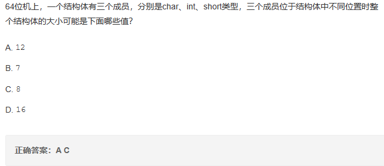
    - 内存对齐[内存对齐的规则以及作用 - 蜗牛小居 - C++博客 (cppblog.com)](http://www.cppblog.com/snailcong/archive/2009/03/16/76705.html)

16. 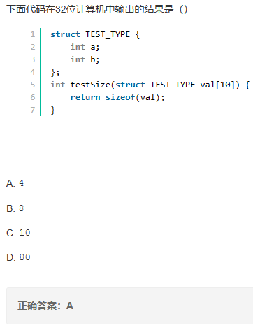
    - 子函数中传递的数组被当成指针对待，sizeof()以后只是一个指针的大小
    - 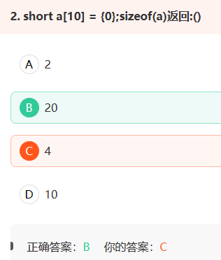
