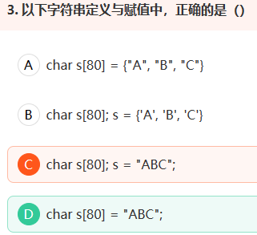

1. 

   - free(str)只是释放了str指针所指向的内存区域，并未修改指针本身的地址值，所以str!=NULL,但是str是一个野指针（野指针 指向一个已删除的对象或未申请访问受限内存区域的指针），访问内存区域是受限的

2. 

3. 

   - 首先说明，short类型的表示范围是 -32768 ~ + 32767，65537用int表示，为0000 0000 0000 0001 0000 0000 0000 0001，转化为short的时候高两位字节丢失，于是变成1，求j的值是再将i转化为int类型，高位两位字节补0，所以i没有变化，j的值为2。

4. 

5. 不能被重载的运算符 1、. (成员访问运算符) 2、.* (成员指针访问运算符) 3、:: (域运算符) 4、sizeof(长度运算符) 5、?: (条件运算符）

6. 

   - printf返回字符串长度，不包含\\0,\\n

7. 

8. 

   - \#define SUM(x,y) x+y 这是在定义宏 宏不仅替换字符串 还替换参数列表

     原式a=a+a*SUM(a,b)*b=a+a*a+b*b=16

9. 
10. 

11. 

12. 

13. 

    - 长度为9，大小（sizeof）为10
    - strlen为计算字符串长度的函数，sizeof为操作符，用于计算占用空间的大小
    - 数组做sizeof的参数不退化，而传递给strlen就变为指针
    - strlen必须以char \*作为参数，且必须以'\0'结尾；而sizeof()可以用于其他类型；

14. 

15. 
    - 内存对齐[内存对齐的规则以及作用 - 蜗牛小居 - C++博客 (cppblog.com)](http://www.cppblog.com/snailcong/archive/2009/03/16/76705.html)

16. 
    - 子函数中传递的数组被当成指针对待，sizeof()以后只是一个指针的大小
    - 

17. 
    - 
18. 

19. 

20. 

21. 

22. 

23. 
    - 

24. 

25. 

26. 

27. 
    - A选项，数组元素要使用单引号，故A选项错误；B，C选项，数组名代表的是数组的首地址，也是数组第一个元素的地址，不能进行赋值操作
       D选项，正确，在栈区为s数组开辟80字节，并对其初始化，故是使用字符数组模拟字符串

28. 

 指针自增、自减每次移动的偏移量是指针所指向对象的字节大小，所以p++与q的偏移量是2个字节。 

  指针相减的值是指针地址的偏移除以指针每次移位的大小； 

  1)p-q=1;偏移量为2个字节，每次移动2个字节，所以为1 

  2)(char\* )p-(char\* )q，指针的偏移没变，但是指针移位是按照short*类型移动，即每次移动2个字节，short为1，转为char\*为2，所以是2 

  3)sizeof（\*arr）表示的是arr数组的第一个字符所占的大小为2个字节，sizeof（arr）表示数组所有元素的字节个数为15*2=30个字节。两者相除代表数组元素个数。

29. 

30. 

- E(e)前面为十进制整数或实数且不能省略，E(e)后面为十进制整数且不能为实数且不能省略

31. 这里p是数组  这里p是数组指针,指向长度为3的数组，初始化指向s；P+i代表p指针向后移动i个长度为3的int数组的大小； *(p+i)+j，表示p+i 指针再向后移动j个int长度,也就是&s\[i]\[j]
32. 

33.

34. 

35. 

36. 

37. 

38. 

39. 

40. 

41. 

42. ![ima
