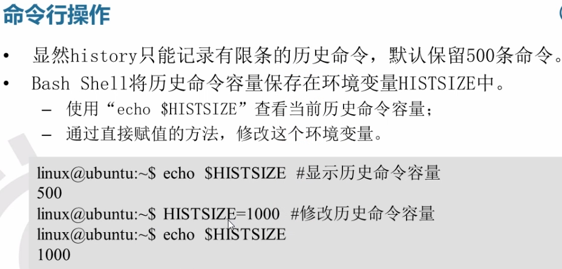

# 常用命令笔记

- ！！执行上一条指令
- ps显示进程

# 介绍

- Linux最主要的应用领域是服务器领域
- 特点：开源，免费，稳定
- 主要发行版:Ubuntu(乌班图) ，RedHat, CentOS
- Linux和Unix的关系
- 网络连接模式：
  - 桥接模式：虚拟系统可以和外部系统通讯，但是容易造成IP冲突
  - Nat模式：网络地址转换，虚拟系统可以和外部通讯，不造成IP冲突，通过代理访问网络，外部不能通过虚拟机的IP访问
  - 主机模式：独立系统，不和外部连接

# Linux体系结构


# Linux目录结构

- Linux的文件系统是采用级层式的树状目录结构，在此结构中的最上层是根目录“/”, 然后在此目录下在创建其他的目录
- **在Linux世界里，一切皆文件**
- 具体的目录结构
  - /bin	[常用]，是binary的缩写，这个目录存放着最经常使用的命令
  - /sbin s为super user，存放的是系统管理员使用的系统管理程序
  - /home[常用]，存放普通用户的主目录，在Linux中每个用户都有一个自己的目录，一般该目录名是以用户的账号命名
  - /root[常用] 该目录为系统管理员，即超级权限者的用户主目录
  - /lib 系统开机所需要最基本的动态连接共享库，其作用类似于Windows的dll文件，几乎所有的应用程序都需要这些共享库
  - /lost+found这个目录一般情况下是空的，当系统非法关机后，这里会存放一些文件
  - /etc[常用] 所有的系统管理所需要的配置文件和子目录
  - /boot 存放的是启动Linux时使用的核心文件，包括一些连接文件以及镜像文件
  - /usr [常用] 非常重要的一个目录，用户的很多应用程序和文件都放在这个目录下，与Windows下的program files类似
  - /proc [不能动] 一个虚拟目录，系统内存的映射，访问这个目录来获取系统信息
  - /srv [不能动] 存放一些服务启动之后需要提取的数据
  - /sys[不能动]
  - /temp 用来存放一些临时文件
  - /dev 类似于Windows的设备管理器，把所有硬件用文件的形式存储
  - /mnt [常用]系统提供该目录是为了让用户临时挂载别的文件系统的，我们可以将外部的存储挂载在/mnt/上，然后进入该目录就可以查看里面的内容了
  - /media [常用]Linux系统会自动识别一些设备，如U盘，光驱等，当识别后，Linux会把识别的设备挂载到这个目录下
  - /opt 这是给主机额外安装软件所摆放的目录，如安装Oracle数据库就可以放在该目录下，默认为空
  - /var 存放很多日志，这个目录是存放着不断扩充着的东西，习惯将经常被修改的目录放在这个目录下，包括各种日志文件
  - /usr/local 这是另一个给主机额外安装软件所安装的目录。一般是通过编译源码的方式安装的程序

# vi和vim编辑器

- [Linux vi/vim | 菜鸟教程 (runoob.com)](https://www.runoob.com/linux/linux-vim.html)

- Linux系统会内置vi文本编辑器

- vim具有程序编辑的能力，可以看作是vi的增强版，可以主动的以字体颜色辨别语法的正确性，方便程序设计

- vi和vim常用的三种模式

  - 正常模式

    以vim打开一个档案就直接进入一般模式了，这是默认模式，在这个模式中，可以使用上下左右按键来移动光标，可以使用删除字符或删除整行来处理档案内容，也可以使用复制粘贴来处理文件数据

  - 插入模式

    按下i/I, o/O, a/A, r/R等任何一个字母后才会进入编辑模式，一般来说按i即可

  - 命令行模式

    在这个模式当中哦，可以提供相关的指令，完成读取，存盘，替换，离开vim，显示行号等的动作则是在此模式中达成的

    - 先输入esc,再输入: 进入命令行模式

  - 

# gcc编译器

- gcc -o hello hello.c
  - -o 输出可执行文件
  - -c 只要求编译器输出目标代码(.o文件)，不必输出可执行文件
  - -g 用于调试
  - ./hello 查看调试结果
  - -wall 语法不规范警告

# Makefile

- 工程管理器，用来管理较多的文件

- make工程管理器是“自动编译管理器”，自动是指根据文件时间戳自动发现更新过的文件而减少编译的工作量，它通过读入makefile文件的内容来执行大量的编译工作

- makefile只编译改动过的文件

- Makefile是make读入的唯一配置文件

  - 由make工具创建的目标体(target)，通常是目标文件或可执行文件
  - 要创建的目标体所依赖的文件(dependency_file)
  - 创建每个目标体时需要运行的命令（command）
  - 命令行前面必须是一个tab键否则会报错

- 

- 

- 示例

  

  ​			通过make命令执行makefile生成test输出文件

## 变量

- 
- 
- 
- 

## makefile的隐含规则

- 
- 

## 虚路径 VPATH

- 
- 

## makefile的嵌套

# 关机和重启

- shutdown -h now 立刻关机
- shutdown -h 1 1分钟后关机
- shutdown -r now 现在重新启动计算机
- halt 关机
- reboot 现在重新启动计算机
- sync 把内存的数据同步到磁盘
- 不管是重启系统还是关闭系统，首先要运行sync命令，把内存中的数据写到磁盘中
- 目前的shutdown/reboot/halt指令已经在关机前进行了sync
- 

# 用户管理

## 用户登陆和注销

- 登陆时尽量少用root账号登陆，因为他是系统管理员，最大的权限可能会造成操作失误，可以利用普通用户登陆，登陆后再用 su -用户名 来切换成系统管理员身份
- logout 注销用户

## 添加用户

- Linux是一个多用户多任务的操作系统，任何一个要使用系统资源的用户都必须向系统管理员申请一个账号，然后以这个账号的身份进入系统
- 基本语法 *useradd 用户名*
- 当创建用户成功后，会自动创建和用户同名的家目录
- 也可以通过useradd -d 目录 用户名 给创建的用户指定家目录

## 指定/修改密码

- *passwd 用户名*

## 删除用户

- *userdel 用户名*
- *userdel -r 用户名*  连家目录一起删除
- 一般情况下建议保留家目录

## 切换用户

- su - 切换用户名
- 当从权限高的用户切换到权限低的用户不需要输入密码，反之需要
- 当需要返回到原来用户时，使用exit/logout指令
- su 切换到root用户

## 查看当前用户信息

- whoami/who am i

## 用户组

- 类似于角色，系统可以对有共性（有相同权限）的多个用户进行统一的管理
- 新增组
  - groupadd 组名
- 删除组
  - groupdel 组名
- 增加用户时直接加上组
  - useradd -g 用户组 用户名
- 组id 
  - id 用户名
- 修改用户的组
  - usermod -g 用户组 用户名
- 用户和组相关的文件
  - /etc/passwd 文件：用户的配置文件，记录用户的各种信息
    - 每行的意义：用户名：口令：用户标志号：组标志号：注释性描述：主目录：登陆shell
  - /etc/shadow 文件：口令配置文件
    - 每行的含义：登录名：加密口令：最后一次修改时间：最小时间间隔：最大时间间隔：警告时间：不活动时间：失效时间：标志
  - /etc/group 文件：组配置文件，记录Linux包含的组的信息
    - 每行含义：组名：口令：组标志号：组内用户列表

# 实用指令

## 运行级别

- 指定运行级别
- 运行级别说明
  - 0：关机
  - 1：单用户（找回丢失密码）多用于维护和调试
  - 2：多用户状态没有网络服务
  - 3：多用户状态有网络服务
  - 4：系统未使用保留给用户
  - 5：图形界面
  - 6：系统重启
- 常用的运行级别是3和5，也可以指定默认的运行级别
- 命令 init [0/1/2/3/4/5/6]  通过init来切换不同的运行级别
- *systemctl get-default*   获取默认运行级别
- systemctl set-default X.target    X = multi-user/graphical/

## 找回root密码

- 首先启动系统，进入开机界面，在界面中按 e 进入编辑界面
- 进入编辑界面，使用键盘上的上下键把光标往下移动，找到以Linux16开头内容所在的行数，在行的最后输入init = /bin/sh
- 输入完成后，直接按快捷键 CTRL + X 进入单用户模式
- 然后输入 mount -o remount,rw / 完成后按回车键
- 在新的最后一行输入passwd，然后按回车，输入密码，再次确认密码，密码修改成功后会显示passwd…..，说明密码修改成功
- 在鼠标闪烁位置输入 touch / .autorelabel（注意空格），完成后回车
- 继续在光标闪烁处输入 exec/sbin/init (注意空格),完成后回车，等待系统自动修改密码（时间较长）完成后系统自动重启，新密码生效

## 帮助指令

- man [命令或配置文件]    eg: man ls    获得帮助信息
- 在Linux下隐藏文件是以 . 开头的 选项可以组合使用 eg: ls -al(al是 -a 和 -l)
- help 命令 

## 文件目录类

- pwd指令    显示当前工作目录的绝对路径
- 绝对路径：从根目录开始
- 相对路径：从当前位置开始
- ls指令 
  - 语法  ls \[选项][目录/文件]   常用选项：-a:显示当前目录所有文件和目录，包括隐藏的  /   -l:以列表的方式显示信息
- cd指令  
  - cd[参数]：切换到指定目录
  - cd ~    回到自己的家目录
  - cd ..    回到当前目录的上一级目录  eg:使用相对路径切换到root   cd ../../root
- mkdir指令：创建目录
  - 语法 mkdir [选项] 要创建的目录    选项  -p : 创建多级目录
  - mkdir /home/dog    创建一级目录
  - mkdir -p /home/animal/dog  创建多级目录
- rmdir指令：删除空目录(必须要是空目录)
  - rmdir /home/dog
  - rm -rf /home/animal/    强制删除目录
- touch指令：创建空文件
  - touch [文件夹名]
- cp指令：拷贝文件到指定目录
  - 语法： cp [选项] 源 目标文件    选项 -r  : 递归复制整个文件夹
- mv指令
  - mv oldfilename newfilename   重命名文件
  - mv  /home/liujunr/dog.txt /home  移动dog.txt文件到home
- cat指令 查看文件内容
  - cat [选项] 要查看的文件   选项  -n   : 显示行号
  - cat只能浏览文件，而不能修改文件，一般与管道命令一起使用 |more
- more指令: 基于vi编辑器的文本过滤器，他以全屏幕的方式按页显示文本文件的内容，more指令中内置了若干快捷键（交互的指令）
  - more 要查看的文件
  - 

- less指令：用来分屏查看文件内容，与more指令类似但是比more指令更加强大，支持各种显示终端。less指令在显示文件内容时并不是一次性将整个文件加载之后才显示，而是根据显示需要加载内容，类似于动态加载，对于显示大型文件具有较高的效率
  - less 要查看的文件

- echo指令：输出内容到控制台
  - 语法：echo \[选项][输出内容]
  - eg:输出hostname   echo \$HOSTNAMEECHO 
- head指令：用于显示文件的开头部分内容，默认显示文件的前十行
  - 语法 head 文件/head -n 5 文件  显示文件的前五行 
- tail指令：用于显示文件尾部的内容，默认为最后十行
  - tail 文件：查看文件尾10行内容
  - tail -n 5 文件 ：查看文件尾5行内容
  - tail -f 文件：实时追踪该文档的所有更新
    - tail -f /home/mydata.txt
    - ctrl+c退出追踪
- \> 指令和\>>指令：输出重定向
  - echo “hello” \> /home/liujun/mydata.txt 将输出内容输入到mydata.txt
  - 一个箭头表示会覆盖原有内容；两个箭头表示会在原有文件中追加内容
  - 如果重定向的文件不存在则会自动创建该文件
- ln指令：软链接也称为符号链接，类似于快捷方式，主要存放链接其他文件的路径
  - in -s \[源文件或目录] [软链接名]   给原文件创建一个软连接
  - rm -rf 删除对应链接
- history:查看已经执行过的命令，也可以执行历史指令
  - history  查看历史指令
  - history 10 查看最近使用过的10个指令
  - !5   重新执行执行过的第五条指令

## 时间日期类

- date指令  显示当前时间
  - date +%Y 显示当前年份
  - date +%m 显示当前月份
  - date +%d 显示当前天数
  - date “+%Y-%m-%d %H:%H:S”
- date -s  设置系统时间
  - date -s “2022-3-24 15:47:20”  设置当前时间
- cal:查看日历信息
  - cal 2022  查看2022年整年的信息

## 搜索查找类

- find指令：将从指定目录向下递归地遍历其各个子目录，将满足条件地文件或目录显示在终端

  - find \[搜索范围] [选项]

  - | 选项  | 功能                             |
    | ----- | -------------------------------- |
    | -name | 按照指定的文件名查找模式查找文件 |
    | -user | 查找属于指定用户名所有文件       |
    | -size | 按照指定的文件大小查找文件       |

- locate指令：可以快速定位文件路径，locate指令利用事先建立的系统中所有文件名称及路径的locate数据库实现快速定位给定的文件，locate指令无需遍历整个文件系统，查询速度较快，为了保证查询结果的准确度管理员必须定期更新locate时刻

  - 由于locate指令基于数据库进行查询，所以第一次运行前必须使用updatedb指令创建locate数据库
  - locate test.txt

- which指令：查看某个指令在哪个目录下，比如ls指令在哪个目录

  - which ls

- grep指令和管道符号|

  - grep 过滤查找 

  - 管道符 | 表示将前一个命令的处理结果输出传递给后面的命令处理

  - grep [选项] 查找内容 源文件

  - | 选项 | 功能             |
    | ---- | ---------------- |
    | -n   | 显示匹配行及行号 |
    | -i   | 忽略字母大小写   |

  - eg: cat /home/liujun/test.txt | grep -n “yes”

## 压缩和解压类

- gzip/gunzip指令：gzip用于压缩/gunzip用于解压

- zip/unzip指令：zip用于压缩/unzip用于解压，多用于项目打包发布中

  - zip \[选项] xxx.zip 需要压缩的内容
  - unzip \[选项] xxx.zip
  - zip选项 -r : 递归压缩，即压缩目录
  - unzip选项 -d\<目录>：指定解压后文件的存放目录

- tar指令：是打包指令，最后打包后的文件是.tar.gz文件

  - 语法 tar \[选项] xxx.tar.gz 打包的内容

  - | 选项 | 功能               |
    | ---- | ------------------ |
    | -c   | 产生.tar打包文件   |
    | -v   | 显示详细信息       |
    | -f   | 指定压缩后的文件名 |
    | -z   | 打包同时压缩       |
    | -x   | 解包.tar文件       |

  - 有多个文件在文件之间加空格即可

  - tar -zcvf myhome.tar.gz /home/   将home这个文件夹打包

  - tar -zxvf /home/myhome.tar.gz -C /opt/temp  将home包解压到/opt/temp中

# 组管理和权限管理

- 在Linux中的每个用户必须属于一个组，不能独立于组外，在Linux中每个文件有所有者，所在组，其他组的概念
- 除文件的所有者和所在组的用户外，系统的其他用户都是文件的其他组

## 文件/目录所有者

- 一般为文件的创建者就是文件的所有者
- 修改文件的所有者
  - *chown 用户名 文件名*
- 查看文件所有者-ivh-ivh 
  - *ls -ahl*

## 组

### 组的创建

- groupadd 组名
- useradd -g gruopname username  创建一个用户并把用户加入一个组

### 组的修改

- *chgrp 组名 文件名*

### 改变用户所在组

- 在添加用户时，可以指定将该用户添加到哪个组中，同样的用root的管理权限可以改变某个用户所在的组
- 改变用户所在的组
  - *usermod -g 新组名 用户名*
  - *usermod -d 目录名 用户名*    改变用户登陆的初始目录/用户必须有进入到新目录的权限

## 权限

### 权限的基本介绍

- *ls -l*  显示的内容如下/或者直接输入 *ll*

  drwxrwxr-x. 2 liujun liujun 23 3月  24 00:33 test

  前十位的说明：

  - 第0位确定文件类型
    - l是链接，相当于Windows的快捷方式
    - d是目录，相当于Windows的文件夹
    - c是字符设备文件，鼠标，键盘
    - b是块设备，比如硬盘
  - 第1-3位确定所有者拥有该文件的权限
  - 第4-6位确定所属组拥有该文件的权限
  - 第7-9位确定其他用户拥有该文件的权限

- rwx作用到文件

  \[r]代表可读取，查看       

  \[w]代表可以修改文件但是不代表可以删除文件，删除一个文件的前提条件是对该文件所在的目录有写权限才能删除该文件

  \[x] 代表可执行

- rwx作用到目录

  \[r]代表可以读取，ls查看目录内容

  \[w]代表可以修改，对目录内创建删除重命名目录

  \[x]代表可执行，可进入该目录

- 第11位：如果是文件就是1，如果是目录，则第11位表示文件数+子目录数
- 随后的liujun  用户
- 第二个liujun 组名
- 23：代表文件大小，如果是文件夹，就显示4096字节
- 日期：最后修改的日期
- test 文件名

### 修改权限

- chmod 指令可以修改文件或目录的权限
- 第一种方式：=/+/- 变更权限
  - u:所有者   g: 所在组  o: 其他人  a:所有人
    - *chmod u=rwx,g=rx,o=x 文件/目录名*    所有者有读写执行权限，所在组有读和执行的权限，其他人有执行权限
    - *chmod o+w 文件/目录名* 其他人赋予写的权限
    - *chmod a-x 文件/目录名*  所有人的执行权限都去掉
- 第二种方式：通过数字变更权限
  - r = 4; w = 2; x = 1
  - *chmod 751 文件/目录名*   = *chmod u= rwx, g = rx, o = x 文件/目录名*
- 对于文件夹wrx
  - w：表示可以在该目录删除或者创建文件
  - x: 表示可以进入到该目录
  - r:表示可以将目录的内容显示


### 修改文件所有者

- *chown 新所有者name 文件/目录*   改变文件所有者
- *chown newowner:newgroup 文件/目录* 改变文件所有者和所在组
- *chown -R liujun /home/test* 将test文件夹中所有的文件的所有者改为liujun

### 修改文件/目录所在组

- *chgrp newgroup 文件/目录* 修改文件所在的组
- *chgrp -R newgroup 文件/目录* 将某目录下的所有文件的所在组修改

# 任务调度

## crond任务调度

- crontab进行定时任务的设置
- 任务调度：指系统在某个时间执行的特定的命令或程序
- 任务调度分类：
  -  系统工作：有些重要的工作必须周而复始的执行，如扫描病毒
  - 个别用户工作：个别用户可能希望执行某些程序，如定时对sql数据库的备份

- 基本语法：crontab \[选项]

- service crond restart \[重启任务调度]

- 常用选项

  | -e   | 编辑crontab定时任务           |
  | ---- | ----------------------------- |
  | -l   | 查询crontab任务               |
  | -r   | 删除当前用户所有的crontab任务 |

- 编辑任务调度

  */1 * * * * ls -l /etc/ > /tmp/to.txt

  | 符号    | 作用             | 范围                  |
  | ------- | ---------------- | --------------------- |
  | 第一个* | 一小时中第几分钟 | 0-59                  |
  | 第二个* | 一天中第几小时   | 0-23                  |
  | 第三个* | 一个月中的第几天 | 1-31                  |
  | 第四个* | 一年中的第几个月 | 1-12                  |
  | 第五个* | 一周中的星期几   | 0-7（0和7都是星期天） |

- 特殊符号说明

  | 符号 | 含义                                                         |
  | ---- | ------------------------------------------------------------ |
  | *    | 代表任何时间                                                 |
  | ,    | 代表不连续时间，如”0 8，12，16 *** 命令‘’代表每天8，12，16点执行一次命令 |
  | -    | 代表连续的时间范围，如“0 5 * * 1-6命令”代表周一到周六的凌晨五点0分执行命令 |
  | */n  | 代表每隔多久执行一次，比如“\*/10 \* * * *命令”代表每隔10分钟执行一遍命令 |

  

  

- 案例

  

## at定时任务

- at命令是一次性定时计划任务，at的守护进程atd会以后台模式运行，检查作业队列来运行

- 默认情况下，atd守护进程每60秒检查作业队列，有作业时会检查作业运行时间，如果时间与当前时间匹配，则运行此作业

- at命令是一次性定时计划任务，执行完一个任务后就不再执行此任务了

- 在使用at命令的时候，一定要保证atd进程的启动，可以使用相关指令来查看

  - ps -ef指令检测当前进程
  - ps -ef |grep atd 显示atd是否运行

- at命令格式

  - *at \[选项] [时间]*
  - ctrl+D 结束at命令的输入（需要输入两次）
  - *atq* 查看定时任务
  - *atrm [编号]* 删除定时任务
  - 选项

  - 时间定义

  - 

    输入两次CTRL+D结束

# Linux分区

- Linux无论有几个分区，分给哪一个目录使用，归根结底就只有一个根目录，一个杜丽且唯一的文件结构，Linux中每个分区都是用来组成整个文件系统的一部分
- Linux采用了一种叫做**载入**的处理方法，他的整个文件系统中包含了一整套的文件和目录，且将一个分区和一个目录联系起来，这时要载入的一个分区将使它的存储空间在一个目录下获得

## 磁盘分区

- 硬盘说明：Linux硬盘分为IDE硬盘和SCSI硬盘，目前基本上是SCSI硬盘
  - 对于IDE硬盘，驱动器标识符为“hdx~”，其中*hd*表示分区所在的设备类型，这里是指IDE硬盘，*x*为盘号(*a*为基本盘，*b*为从属盘，*c*为辅助盘，*d*为辅助从属盘)，`~`为分区，前四个分区用数字1-4表示，他们是主分区或扩展分区，从5开始就是逻辑分区。如hd3表示为第一个IDE硬盘上的第三个主分区或扩展分区，hdb2表示为第二个IDE硬盘上的第二个主分区或扩展分区
  - 对于SCSI硬盘标志为*sdx~*,scsi硬盘是用*sd*来表示分区所在设备类型的，其余则和IDE硬盘表示方法一样
- 查看设备挂载情况
  - 命令： *lsblk* 或者 *lsblk -f*
  - 
  - uuid: 每个分区唯一的40位的标识符
  - mountPoint: 挂载点

## 增加磁盘

- 如何增加一块硬盘
  - 虚拟机增加一块硬盘
    - 在硬件中添加新硬盘，需要重启后系统才能识别
  - 对硬盘进行分区
    - 分区命令 *fddisk /dev/sdb*  dev为设备文件夹
    - 开始对/sdb分区
      - m显示命令列表
      - p 显示磁盘分区
      - n 新增分区
      - d 删除分区
      - w 写入并退出
      - 说明：开始分区后输入n, 新增分区，然后选择p, 分区类型为主分区，两次回车默认剩余全部空间，最后输入w写入分区并退出，若不保存退出输入q
    - 格式化硬盘：格式化之后生成uuid
      - mkfs -t ext4 /dev/sdb1    其中ext4是分区类型
    - 挂载
      - 挂载是将一个分区与一个目录联系起来
      - 指令 *mount  设备名称 挂载目录*
    - 说明：用命令行挂载系统重启后会失效
    - 永久挂载：通过修改/etc/fstab实现挂载，添加挂载的磁盘，完成后，执行mount -a 立即生效
  - 卸载
    - umount 卸载设备或目录

## 磁盘使用情况查询

- 语法 *df -h*
- 查询指定目录的磁盘占用情况
  - 语法 *du -h 目录*
  - -s 指定目录占用大小汇总
  - -h 带计量单位
  - -a 含文件
  - --max-depth = 1 子目录深度
  - -c 列出明细的同时增加汇总值
  - eg:  du -h --max-depth=1 /opt

## 磁盘实用指令

- 统计/opt文件夹下文件的个数
  - *ls -l /opt | grep "^-"|wc -l*   显示以-开头的文件个数
- 统计/opt文件夹里目录的个数
  - *ls -l /opt |grep "^d" |wc -l*
- 统计/opt文件的个数，包括子文件夹里ide文件的个数
  - *ls -lR /opt |grep "^-" |wc -l*   注意大写的R

- 以树状显示目录结构（默认没有安装tree, yum install tree）
  - *tree /opt*

# Linux网络


- 在Windows查看VMnet8网络配置指令：ipconfig
- 在Linux下查看网络配置：ifconfig
- ip地址在同一个网段才能够通讯
- ping 目的主机：测试是否能够连接目的主机（CTRL+C结束该指令）

## 设置固定IP地址


## 设置主机名和hosts映射

- 为了方便记忆，可以给Linux系统设置主机名，也可以根据需要修改主机名

- 指令hostname查看主机名

- 修改文件在/etc/hostname指定

- 修改后重启生效

- 设置hosts映射

  - 如何通过主机名来找到Linux系统

  - 上述指定完成后直接ping主机名即可

- 主机名和解析过程分析（Hosts，DNS）
  - Hosts：一个文本文件，用来记录IP和hostname(主机名)的映射关系
- DNS：是互联网上作为域名和IP地址相互映射的一个分布式数据库

# 进程管理

- 在Linux中，每个执行的程序都称为一个进程，每一个进程都分配一个id号（pid, 进程号）
- 每个进程都可能以两种方式存在的。前台与后台，所谓前台进程就是用户目前的屏幕上可以进行操作的，后台进程则是实际在操作，但由于屏幕上无法看到的进程，通常使用后台方式执行
- 一般系统的服务都是以后台进程的方式存在，而且都会常驻在系统中，知道关机才结束

## 显示进程ps

- 显示系统执行的进程
  - ps命令是用来查看目前系统中有哪些正在执行的进程，以及他们的执行状况，可以不加任何参数
  - ps -a 显示当前终端的所有进程信息
  - ps -u 以用户的格式显示进程信息
  - ps -x 显示后台进程运行的参数
  - ps -aux|grep xxx
  - ps -ef 以全格式显示当前所有的进程，-e显示所有进程，-f 为全格式
  - 显示的参数意义：
    - PID：进程识别号
    - PPID：父进程的pid
    - TTY：终端机号
    - TIME：此进程所消耗CPU的时间
    - CMD：正在执行的命令或进程名，如果过长会被截断
    - STAT：S-表示休眠, s-表示该进程是会话的先导进程；N-表示进程拥有比普通优先级更低的优先级，R-表示运行状态，D-短期等待，Z-僵死进程，T-被跟踪或者被停止等等
    - %MEN: 进程占用物理内存的百分比
    - %CPU：进程占用CPU的百分比
    - VSZ：进程占用的虚拟内存大小，单位KB
    - RSS：进程占用的物理内存大小

## 终止进程kill

- 某个进程执行一半需要停止时，或是已经消耗了很大的系统资源时，此时可以考虑停止该进程，使用kill命令来完成此项任务
- 基本语法
  - *kill \[选项] 进程号* 通过进程号来杀死进程
  - *killall 进程名称*  通过进程名称来杀死进程，也支持通配符，这在系统因负载过大而变得很慢时很有用
  - 常用选项 -9: 表示强迫进程立即停止
  - 重启杀死的进程 /bin/systemctl start 服务名称.service
- 应用：
  - 踢掉某个非法登陆用户
  - 强制杀掉一个终端

## 查看进程树pstree

- 基本语法：pstree \[选项] 可以更加直观的查看进程信息
  - 选项 ：-p:显示进程的pid    -u 显示进程的所属用户

# 服务管理

- 服务本质就是进程，但是是运行在后台的，通常会监听某个端口，等待其他程序的请求，比如mysqld\[通常为3306端口]，sshd,因此我们又称为守护进程
- service管理指令
  - 在centOS7.0后，很多服务不再使用service，而是systemctl
  - service 服务名\[start / stop/ restart/ reload/ status]
  - service指令管理的服务在/etc/init.d查看  *ll /etc/init.d/*
- *setup* 查看系统服务
  - 系统服务中带*的系统开机时自动启动，可以手动取消；tab键取消

## 服务的运行级别

前面有

开机流程说明：

开机---BIOS---/boot—systemd进程1—-运行级别----启动运行级别对应的服务

- chkconfig指令
  - 通过chkconfig命令可以给服务的各个运行级别设置自启动/自关闭
  - chkconfig指令管理的服务在 /etc/init.d查看
  - 基本语法 
    - 查看服务 chkconfig –list \[|grep xxx]
    - chkconfig 服务名 --list
    - chkconfig –level 5 服务名 on/off    设置某个服务在某个级别是否自启动
  - 该命令需要重启reboot生效

## systemctl管理服务

- 基本语法：*systemctl \[start|stop|restart|status] 服务名*
- systemcrl指令管理的服务在 /usr/lib/systemd/system 查看
- systemctl设置服务自启动状态
  - *systemctl list-unit-files \[|grep 服务名]*  查看服务开机启动状态，grep可以进行过滤
  - *systemctl enable 服务名* 设置服务开机启动（默认为3和5运行级别）
  - *systemctl disable 服务名* 关闭服务开机启动
  - systemctl is-enabled 服务名 查询某个服务是否是自启动
- stop关闭或start启动防火墙服务会立即生效，但是这个命令是临时的
- 如果希望设置某个服务自启动或自关闭永久生效，要使用systemctl \[enable/disable] 服务名.service

## 打开或关闭指定端口

- 在真正的生产环境中往往需要将防火墙打开，但是外部请求数据包就不能跟服务器监听端口通讯，这时需要打开指定端口
- firewall 指令
  - 打开端口*firewall-cmd –permanent –add-port=端口号/协议*
  - 重新载入上面指令才能生效 *firewall-cmd –reload*
  - 查询端口是否开放*firewall-cmd –query-port=端口号/协议*
  - 关闭端口*firewall-cmd –permanent –remove-port=端口号/协议*

## 动态监控系统

- top与ps命令相似，他们都是用来显示正在执行的进程，top与ps最大的不同之处在于top执行一段时间可以更新正在运行的进程

- 基本语法*top \[选项]*

  - | 选项    | 功能                                       |
    | ------- | ------------------------------------------ |
    | -d 秒数 | 指定top命令每隔几秒更新，默认为3秒         |
    | -i      | 使top不显示任何闲置或僵死进程              |
    | -p      | 通过指定监控进程id来仅仅监控某个进程的状态 |

- 

  - [Linux中top命令参数详解_阿斯兰·萨拉的博客-CSDN博客](https://blog.csdn.net/qq_44679723/article/details/109486639)

- load average:系统负载，即任务队列的平均长度。 三个数值分别为 1分钟、5分钟、15分钟前到现在的平均值。取三个值加起来除3，最后如果大于0.7则说明系统负载较大

- 交互操作说明：在top指令运行时输入以下指令

  - | 操作 | 功能                        |
    | ---- | --------------------------- |
    | P    | 以CPU使用率排序，默认为此项 |
    | M    | 以内存的使用率排序          |
    | N    | 以PID排序                   |
    | q    | 退出top                     |

  - 监控某特定用户

    - 输入top，然后输入u回车，再输入用户名即可

  - 终止指定进程

    - 输入top，然后输入K回车，再输入要结束的进程id号

## 监控网络状态

- 基本语法 *netstat \[选项]*
  - 选项说明 -an 按一定顺序排列输出  -p 显示哪个进程在调用

# rpm包的管理

- 
- rpm用于互联网下载包的打包及安装工具，包含在某些Linux分发版本中，它生成具有.RPM扩展名的文件。RPM是Redhat package manager的缩写，类似于Windows的setup.exe，是公认的行业标准
- rpm包的简单查询指令
  - *rpm -qa|grep xx* 查询已安装的rpm列表
- rpm包的基本格式
  - firefox-91.7.0-3.el7.centos.x86_64
  - 名称 Firefox
  - 版本号 91.7.0-3
  - 使用操作系统 el7.centos.x86_64
  - i686/i386表示32位系统，norach表示通用
- rpm -q 软件包名：查询软件包是否安装
- rpm -qi 软件包名：查询软件包信息
- rpm -ql 软件包名：查询软件包中的文件
- rpm -qf 文件全路径名 查询文件所属的软件包
  - rpm -qf /etc/passwd
- 卸载rpm包
  - *rpm -e rpm软件包名称*
  - *rpm -e –nodeps foo* 强制删除foo包，可能会造成依赖于该软件包的程序无法运行
- 安装rpm包
  - *rpm -ivh rpm包全路径名称*
    - i = install   v = verbose 提示    h = hash 进度条


## yum

- yum是一个shell前端软件包管理器，基于rpm包管理，能够从指定服务器自动下载rpm包并且安装，可以自动处理依赖性关系，并且一次安装所有依赖的软件包
- yum基本指令
  - 查询yum服务器是否有需要安装的软件 *yum list|grep xx软件列表*
  - *yum install xxx* 安装指定的yum包

# Shell编程

- Shell是一个命令行解释器，它为用户提供了一个向Linux内核发送请求以便运行程序的界面系统级程序，用户可以用shell来启动，挂起，停止甚至是编写一些程序
- LInux中的shell就是Linux内核的一个外层保护工具，负责用户和内核之间的交互
- 
- 

- 
- 

## shell中的特殊字符


## shell脚本执行方式

- 脚本格式要求

  - 脚本以\#!/bin/bash开头
  - 脚本需要有可执行权限
  - 

  - 不赋予权限执行脚本

    

## Shell的变量

- Linux Shell中的变量分为系统变量和用户自定义变量
- 系统变量：\$HOME;\$PWD;\$SHELL;\$USER等等，如echo \$HOME等等
- 显示当前shell中所有变量：set
- 

- shell变量的定义
  - 
  - 定义变量：变量名=值（中间不能有空格）
  - 撤销变量：unset 变量
  - 声明静态变量：readonly变量，注意：不能unset
  - 变量定义规则
    - 变量名称可以由字母，数字和下划线组成，但是不能以数字开头
    - 等号两侧不能有空格
    - 变量名称一般习惯为大写
  - 将命令的返回值赋值给变量
    - A=‘date’  运行date中的指令并把结果返回给A
    - A=\$(date)等价于反引号

## 设置环境变量

- 基本语法
  - export 变量名=变量值（功能：将shell变量输出为环境变量/全局变量）
  - source 配置文件（功能：让修改后的配置信息立即生效）
  - echo \$变量名（功能：查询环境变量的值）
- shell脚本的多行注释： :<<! 需要注释的内容 ！

## 位置参数变量

- 当我们执行一个shell脚本时，如果希望获取到命令行的参数信息，就可以使用到位置参数变量，比如：./myshell.sh 100 200–这个就是执行shell的命令行来获取100和200的值，类似于C的形参

- 


## 预定义变量

- 就是shell设计者实现已经定义好的变量，可以直接在shell脚本中使用
- 

## 运算符

- 基本语法
  - \$((运算式)) 或 \$[运算式] 或者 expr m + n \[expr运算符之间有空格]
  - expr m - n
  - expr \\*, /, % 乘/除/取余
  - expr不能有括号

## 条件判断

- 基本语法
  - \[condition]

- 

## 流程控制

- 基本语法

  - 单分支

    ```shell
    if [ 条件判断式 ]
    then
    代码
    fi
    ```

  - 多分支

    ```shell
    if [ 条件判断式 ]
    then
    代码
    elif [ 条件判断式 ]
    then
    代码
    fi
    ```

    **中括号和条件判断式之间必须有空格**

- case语句

  - 基本语法
  - 


- for循环

  - 基本语法

  - 

  - 

    **注意\$*和\$@的区别**

    

- while循环
  - **注意while和中括号之间有空格**- 

## read读取控制台输入

- *read(选项)(参数)
- 

## 函数

- 系统函数和自定义函数

- 系统函数

  - basename 用来获取文件名
  - 

  - dirname 用来获取路径

    

- 自定义函数

  - ```shell
    [ function ] funname[()]
    {
     action;
     [return int;]
    }
    #调用直接写函数名
    funname [值]
    ```

  - 

## Shell编程综合案例


- - 


# 日志

- 日志文件是 重要的系统信息文件，其中记录了许多重要的系统时间，包括用户的登录信息，系统的启动信息，系统的安全信息，邮件相关信息，各种服务相关信息等
- 日志对于安全来说也十分重要，它记录了系统每天发生的各种事情，通过日志来检查错误发生的原因或者受到攻击时攻击者留下的痕迹
- 日志是用来记录重大事件的工具
- 绝大部分日志文件保存在/var/log目录里面（标红的为常用日志）
- 

- lastlog: 查看用户登陆时间

## 日志管理服务

- 查询Linux中的rsyslogd服务是否启动*ps aux | grep “rsyslog” |grep -v “grep”*   （grep -v 为反向匹配）
- 查询rsyslogd服务的自启动状态 *systemctl list-unit-files | grep “rsyslog”*
- 
- 

- 由日志服务rsyslogd记录的日志文件，日志文件的格式包含以下4列

  - 事件产生的时间
  - 产生事件的服务器的主机名
  - 产生事件的服务名或程序名
  - 事件的具体信息

- *cat secure*

  

- 日志管理服务实例

  - vim /etc/rsyslog.conf

    

## 日志轮替

- 日志论题就是把旧的日志文件移动并改名，同时寄哪里新的空日志文件，当旧日志文件超出保存的范围之后就会进行删除
- 日志轮替文件命名
  - centOS7使用logrotate进行日志轮替管理，要想改变日志轮替文件名字，通过*/etc/logrotate.conf*配置文件中“dateext”参数
  - 如果配置文件中由“dateext”参数，那么日志会用日期来作为日志文件的后缀，这样日志文件名不会重叠，也就不需要日志文件的改名，只需要指定保存日志的个数，删除多余的日志文件即可
  - 如果配置文件中没有“dateext”参数，那么日志文件需要进行改名，当第一次进行日志轮替时，当前的“secure”日志会自动改名为“secure.1”，然后新建“secure”日志，用来保存新的日志。第二次轮替时，“secure”自动改名为‘secure.1’, “secure.1”改名为“secure.2”，然后新建“secure”日志用来保存新的日志，以此类推
- 全局的日志轮替策略

- 可以把某个日志文件的轮替规则写到/etc/logrotate.d目录
- 日志轮替的参数说明
  - 

- 

## 日志轮替机制原理

日志轮替之所以可以在指定的时间备份日志，是依赖系统的定时任务，在/etc/cron.daliy/目录就会发现这个目录中是有logrotate文件(可执行)，logrotate通过这个文件依赖定时任务执行的

## 查看内存日志

- journalctl 可以查看内存日志
- 常用指令
  - journalctl 查看全部
  - journalctl -n 3 查看最新三条
  - journalctl –since 19:00 —until 19:10:10 查看起始时间到结束时间的日志 可加日期
  - journalctl -p err 报错日志
  - journalctl -o verbose 日志详细内容
  - journalctl _PID=1245 _COMM=sshd 查看包含这些参数的日志/或者 journalctl | grep sshd
- journalctl 查看的是内存日志，重启后清空#

# 定制自己的Linux系统

- 通过裁剪现有Linux系统，创建属于自己的min Linux小系统

## 启动流程介绍

- Linux启动流程
  - 首先Linux需要通过自检，检查硬件设备有没有故障
  - 如果由多块启动盘的话，需要在BIOS中选择启动磁盘
  - 启动MBR中的bootload引导程序
  - 加载内核文件
  - 执行所有进程的父进程systemd
  - 欢迎界面
- 在linux的启动流程中加载内核文件时关键文件
  - kernel文件：vmlinuz-3.10.0-957.el7.x86_64
  - initrd文件：initramfs-3.10.0-957.el7.x86_64.img

## 制作min Linux思路分析

- 在现有的Linux系统上加一块硬盘/dev/sdb,在硬盘上分两个分区，一个是/boot，一个是/，并将其格式化。现在加的这个硬盘在现有的Linux系统中是/dev/sdb，但是当我们把东西全部设置好时要把这个硬盘拔除放在新系统上，此时就是dev/sda
- 在/dev/sdb上将其打造成独立的linux系统，里面所有文件时需要拷贝进去的
- 作为能够独立运行的Linux紫铜，内核一定不能少，要把内核文件和inittramfs文件一起拷贝到/dev/sdb上
- 以上步骤完成，自制Linux系统完成，创建一个新的Linux虚拟机，将其硬盘指向我们所创建的硬盘，启动即可

# Linux内核

## 内核源码阅读

## 内核升级

- uname -a 查看当前内核版本

- yum info kernel -q  检测内核版本，显示可以升级的内核
- yum update kernel 升级内核
- yum list kernel -q  查看已经安装的内核

# Linux系统的备份与恢复

- 虚拟机中的快照
- Linux系统的备份与恢复有两种方式：
  - 把需要的文件或分区用tar打包，下次需要恢复的时候再解压覆盖
  - 使用dump和restore命令
- 需要安装dump和restore指令
  - yum  -y install dump
  - yum -y install restore

## dump完成备份

- dump 支持分卷和增量备份（增量备份时指备份上次备份后修改。增加过的文件，也称差异备份）
- dump语法
  - 
  - 

## restore完成恢复

- restore命令用来恢复已备份的文件，可以从dump生成的备份文件中恢复源文件
- restore基本语法
  - restore \[模式选项]\[选项]
  - 四个模式，在一次命令中只能指定一种
    - -C：使用对比模式，将备份的文件与已经存在的文件相互对比
    - -i: 使用交互模式，在进行还原操作时，restore指令将依序询问用户
    - -r:进行还原模式
    - -t:查看模式，看备份文件有哪些文件
  - 选项
    - -f\<备份设备> ： 从指定的文件中读取备份数据，进行还原操作

# webmin

- 安装
- 修改密码
- 修改端口 vim /etc/webmin/minisery.conf  修改port以及listen值
- 重启webmin 
  - /etc/webmin/restart 重启
  - /etc/webmin/start 启动
  - /etc/webmin/stop 停止
- 防火墙开放端口
  - firewall-cmd --zone=public --add-port=6666/tcp --permanent 配置防火墙开放6666端口
  - firewall-cmd —reload 更新防火墙配置
  - firewall-cmd --zone=public --list-ports 查看已经开放的端口号

# bt宝塔

- 安装
- 
- bt default   忘记密码使用

# Linux面试题

- 分析日志文件，将各个ip地址截取并统计出现次数，按从大到小排序
  - 截取命令 cut
  - 排序 sort
    - sort -nr 从大到小排序，默认从小到大
  - 统计 uniq -c  需要先排序后统计才是正确的否则会出错
- 统计连接到服务器的各个IP情况，并按连接数从大到小排序
  - netstat -an 查询链接到服务器的IP
  - grep ESTABLISH
  - awk -F “ ” ‘{print \$5}’ 对每一行按空格分割并打印第五段
- 找回MySQL root密码
  - vim /etc/my.cnf   添加  skip-grant tables
  - service mysqld restart  重启服务
  - mysql -u root -p 进入空密码就行
  - update user set authentication_string=password(“hello”) where user=‘root’;
  - flush privileges; 刷新权限
  - 退出后再 vim /etc/my.conf  将原来添加的注销
  - 重启mysql服务
- 统计IP访问情况，要求分析nginx访问日志(access.log)找出访问页面数量在前两位的IP
  - cat access.log | awk -F “ ” ‘{print \$1}’ |sort | uniq -c | sort -nr | head -2
- 使用tcpdump监听本机，将来自ip 192.168.11.1,tcp端口为22的数据保存输出到tcpdump.log用作数据分析
  - tcpdump -i ens33 host 192.168.11.1 and port 22 >> /opt/tcpdump.log
- Nginx模块
  - 
- 权限管理
  - 注意权限分离，Linux权限和数据库权限不要再同一个部门
  - 权限最小原则
  - 减少使用root用户
  - 重要的系统文件使用chattr锁定，需要操作时再打开（锁定后root用户也不能打开）
    - chattr +i /etc/passwd
    - chattr -i /etc/passwd 解锁
    - mv /usr/bin/chattr /opt 将chattr指令移动到opt目录（藏起来）
    - mv /opt/chattr /opt/h  改名称
  - 可以利用工具rootkit hunter/chkrootkit来监测rootkit脚本
  - 利用工具tripwire检测文件系统完整性
- 说明centos7的启动流程，并说明cengOS6相同和不同的地方
- 列举Linux高级命令，至少六个
  - netstat //网络状态监控
  - top 系统运行状态
  - lsblk 查看硬盘分区
  - ps -aux 查看运行进程
  - chkconfig 查看服务启动
  - find
  - systemctl 管理系统服务
- 指令
  - top 查看内存
  - iotop 查看io读写情况
  - df -lh 查看磁盘
  - netstat -tunlp 查看端口占用情况
  - ps -aux 进程查看
- 使用Linux命令计算t2.txt第二列的和并输出
  - cat t2.tat | awk -F “ ” ‘{sum+=\$2} END {print sum}’
- shell脚本里如何检查一个文件是否存在？并给出提示
  - if \[-f 文件名] then echo “存在” else echo “不存在” fi
- 用shell写一个脚本，对文本t3.txt中无序的一列数字排序并将总和输出
  - sort -nr t3.txt | awk ‘{sum+=\$0; print \$0} END {print “和=” sum}’
- 用指令写出当前文件夹下所有文件中包含字符“cat”的文件名称
  - grep -r “cat” /home | cut -d “:” -f 1
- 写出统计home目录下文件数量和所有文件总行数的指令
  - find /home/test -name “\*.*” | wc -l
  - find /home/test -name “\*.*” | xargs wc -l
- web服务器架构
  - Nginx haproxy keepalives kvs
- 如何优化Linux系统
  - 架构优化 变成集群
  - 不用root,使用sudo提示权限
  - 定时的自动更新服务时间
  - 配置yum源，指向国内镜像
  - 配置合理的防火墙策略，打开必要的端口，关闭不必要的端口
  - 打开最大文件数（调整文件的描述的数量） vim /etc/profile ulimit -SHn 65535
  - 配置合理的监控策略
  - 配置合理的系统重要文件的备份策略
  - 对安装的软件进行优化比如nginx
  - 内核参数进行优化 /etc/sysctl.conf
  - 锁定一些重要的系统文件
  - 禁用不必要的服务 setup
