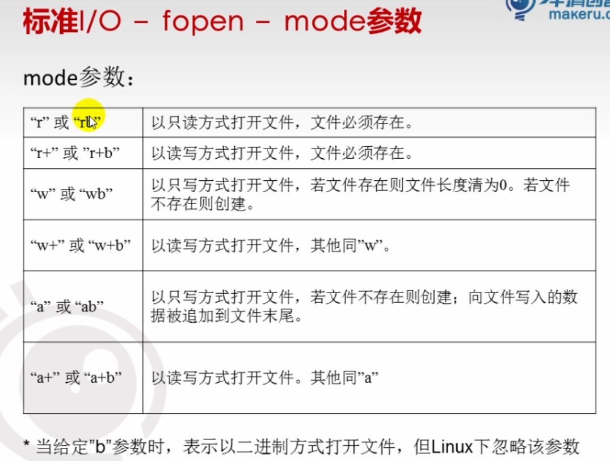
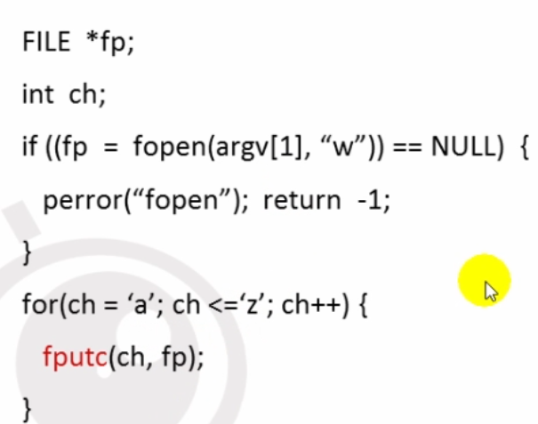
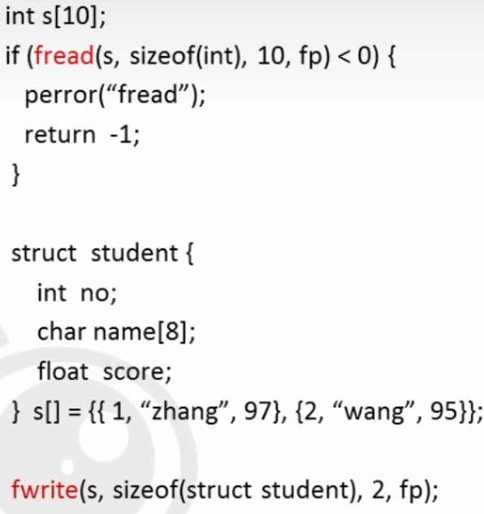
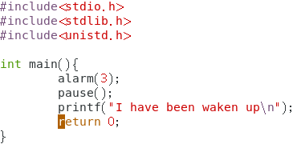
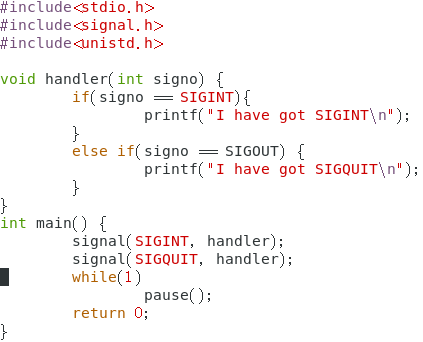
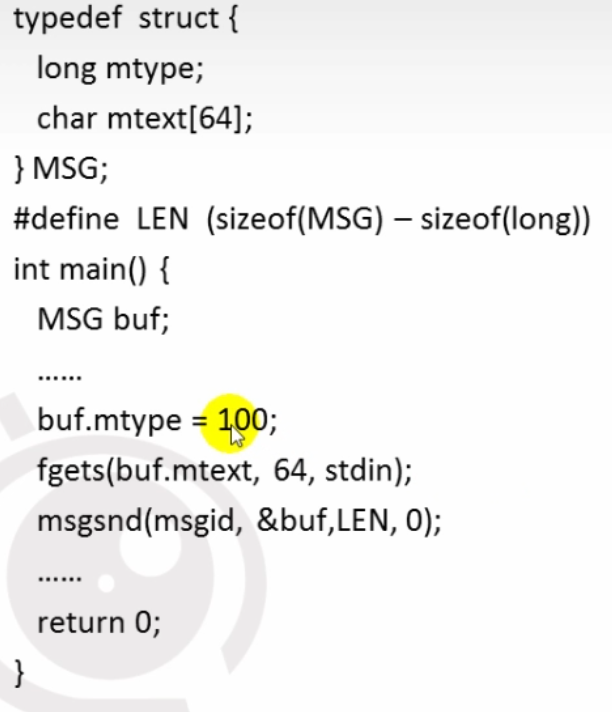
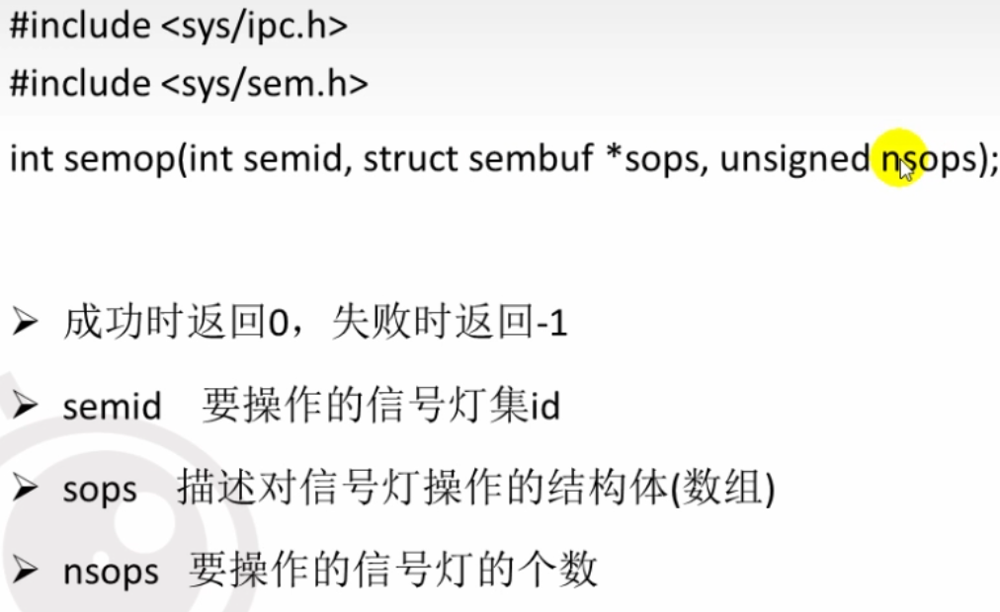
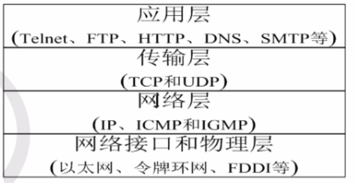
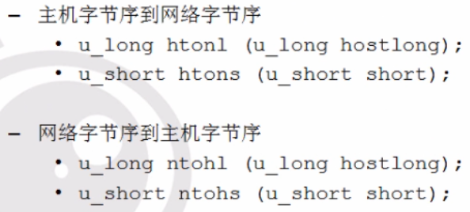
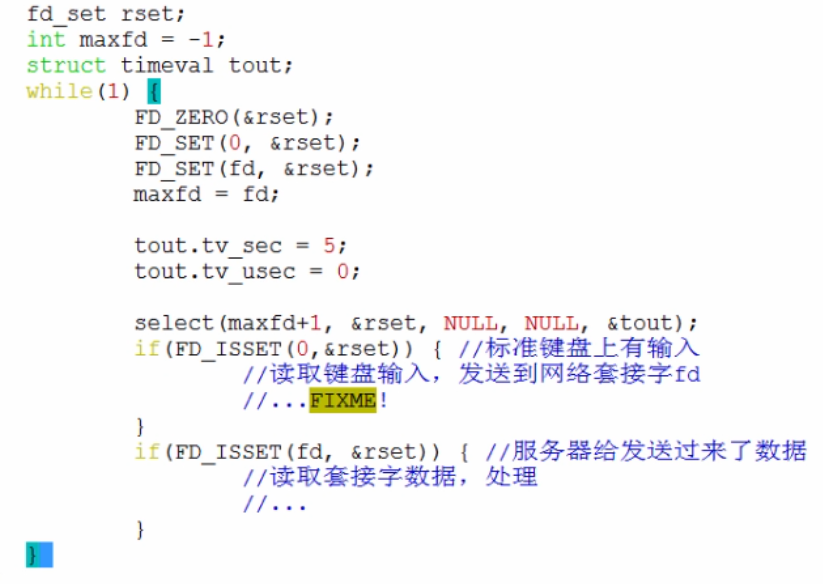

# 基础

- perror函数是一个 C 语言标准库函数，它用于打印与最近系统调用相关的错误消息。

  当程序执行一个系统调用时，如果该调用失败，就会设置一个特定的全局变量 `errno` 来表示出错的类型。`perror()` 函数获取 `errno` 的值并打印对应的错误消息到标准错误输出流（stderr）。

  `perror()` 函数通常用于调试和错误处理。通过在程序中插入 `perror()` 调用，可以帮助开发人员更容易地找出出错的原因

- linux中使得test程序在后台运行 \./test &

- 条件编译是指预处理器根据条件编译指令，有条件地选择源程序代码中的一部分代码作为输出，送给编译器进行编译。主要是为了有选择性地执行相应操作，防止宏替换内容（如文件等）的重复包含；防止头文件重复包含。

- 因为管道内容保存在内存中，所以管道文件大小永远是0

- exit():所在stdlib.h头文件中，功能是关闭所有文件，终止正在执行的进程

  - 


# C语言

## 指针（pointer）

- 指针可以使得程序简洁高效紧凑；有效的表示复杂的数据结构；动态分配内存；得到多于一个的函数返回值
- 内存单元的地址称为指针，专门用来存放地址的变量称为指针变量
- 在不影响理解的情况中，有时对地址、指针和指针变量不区分，通称指针
- 指针形式
  - <存储类型><数据类型>\*<指针变量名>
  - 指针的存储类型是指针变量本身的存储类型
  - 指针说明时指定的数据类型不是指针变量本身的数据类型，而是指针目标的数据类型，简称为指针的数据类型
- 示例 int a, int *pa, \*pa = &a;
- 指针指向的内存区域中的数据称为指针的目标；如果它指向的区域是程序中的一个变量的内存空间，则这个变量称为指针的目标变量，简称为指针的目标
- 指针占几个字节？？
  - 由操作系统位数决定

## 指针运算

- 指针的赋值运算指的是通过赋值运算符向指针变量送的一个地址值，向一个指针变量赋值时，送的必须是地址常量或指针变量，不能是普通整数
- 指针运算的实质是地址的计算，指针运算是以指针变量所存放的地址量作为运算量而进行的运算
- 不同数据类型的两个指针进行加减运算是无意义的
- 
- 两个指针相减的结果值不是地址量，而是一个整数值，表示两指针之间相隔数据的个数
- 两指针之间的关系运算表示它们指向地址位置之间的关系，指向地址大的指针大于指向地址小的指针
- 指针与零进行等于或不等于的关系运算判断指针是否为空

### 指针与数组

- 数组的指针是指数组在内存中的起始地址，数组元素的地址是指数组元素在内存中的起始地址，一维数组名为一维数组的指针
- 
- 使用一级指针遍历二维数组
- 二维数组名为行地址
- 行指针（数组指针）：存储行地址的指针变量叫做行指针变量
  - \<存储类型><数据类型>(\*<指针变量名>)[表达式];
  - 如 int(\*p)[3];
  - 方括号中常量表达式表示指针加1移动几个数据，当用行指针操作二位数组时，表达式一般写成1行的元素个数，即列数
  - 

## 字符指针与字符串

- C语言通过使用字符数组来处理字符串，通常把char数据类型的指针变量称为字符指针变量

- 初始化字符指针是把内存中字符串的首地址赋予指针，并不是把该字符串复制到指针中

  - ```c
    char str[] = "Hello World";
    char *p = str;
    ```

- **当一个字符指针指向一个字符串常量时不能修改指针指向的对象的值**

- 实现strcat函数功能

  

## 指针数组

- 由若干个具有相同存储类型和数据类型的指针变量构成的集合
- 一般形式
  - \<存储类型><数据类型>*<指针数组名>[<大小>]；
  - 指针数组名是指针起始地址
- 指针数组名相当于二级指针

## 多级指针

- 把指向指针变量的指针变量称为多级指针变量
- 指向处理数据的指针变量称为一级指针，把指向一级指针变量的指针变量称为二级指针
- 形式
  - <存储类型><数据类型>\**<指针名>

- 


# 嵌入式Liunx下文件IO

## 文件的概念和类型

- 文件：相关数据的有序集合
- 文件类型
  - 常规文件r：文本文件/二进制文件
  - 目录文件d: 文件夹
  - 字符设备文件c: 
  - 块设备文件b: 将一个设备当成一个文件去访问
  - 管道文件p: 通信机制
  - 套接字文件s
  - 符号链接文件I

## 标准I/O

- C库中定义的标准的输入输出的一组函数
- 主流操作系统上都实现了C库
- 标准IO通过缓冲机制减少系统调用，实现高效率
- 有操作系统的话调用硬件需要通过系统接口对硬件进行调用

## 流（stream）

- 标准IO用一个结构体类型来存放打开文件的相关信息，该结构体就是流

- 标准IO的所有操作都是围绕FILE来进行

- 流的特点就是提供了一种缓冲机制

- 流分为文本流和二进制流

  - Linux中不区分文本流和二进制流的区别

  - windows

    

- 流的缓冲类型
  - 全缓冲：当流的缓冲区无数据或无空间时才执行实际IO操作，默认
  - 行缓冲：当在输入和输出中遇到换行符\n时，进行IO操作，当流和一个终端关联时，典型的行缓冲
- 

### 打开流

- FILE *fopen(const char \*path, const \*mode);
- 成功时返回流指针，出错时返回NULL
- 

- 示例

  

- fopen()创建的文件访问权限是0666（rw-rw-rw-）;linux中umask设定会影响文件的权限；用户可以通过umask函数修改相关设定

- 处理错误信息

  


### 关闭流

- int fclose(FILE \*stream);
- 流关闭时自动刷新缓冲中的数据并释放缓冲区
- 当一个程序正常终止时所有的打开的流都会关闭，流一旦关闭后就不能执行任何操作
- 

### 读写流

- 流支持不同的读写方式：
  - 读写一个字符：fgetc()/fputc()一次读/写一个字符
  - 读写一行：fgets()和fputs()一次读/写一行
  - 读写若干个对象：fread()/fwrite()每次读/写若干个对象，而每个对象具有相同的长度

#### 按字符读写流

- 

- 统计文件字符数




- 利用fgetc和fputc实现文件的复制
  - 通过命令行参数传递源文件和目标文件名
  - 通过fgetc返回值判断是否读到文件尾部
  - 

#### 按行读写流

- 按行输入

- 


- 如何统计一个文本文件包含多少行
  - fgets

#### 按指定对象读写流

- 根据流中所包含的内容格式读写

- ```c
  size_t fread(void *ptr, size_t size, size_t n, FILE *fp);
  size_t fread(const void *ptr, size_t size, size_t n, FILE *fp);
  //成功返回读写的对象个数；出错时返回EOF
  //既可以读写文本文件，也可以读取数据文件
  ```

- 

### 流的刷新

- 三种情况刷新
  - 缓冲区满、\n
  - 流关闭
  - fflush函数
- fflush函数
  - int fflush(FILE *fp);
    - 成功返回0，失败返回EOF
    - 将流缓冲区中的数据写入实际的文件
    - Linux下只能刷新输出缓冲区

### 定位流


### 格式化输出

- 函数

  ```c
  printf(const char *fmt, ...);
  fprintf(FILE *stream, const char *fmt,...);
  sprintf(char *s, const char *fmt);
  ```

  


- 练习

  


# 进程

## 进程基础

- 程序是存放在磁盘上得指令和数据的有序集合，静态的
- 进程是执行一个程序所分配的资源的总称，进程是程序一次执行的过程，是动态的，包括创建、调度、执行和消亡
- 进程内容包括代码，用户数据和系统数据（进程控制块pcb，进程计数器PC、堆栈）三部分
- 进程类型
  - 交互进程: shell下启动，可以是前台或后台运行
  - 批处理进程：
  - 守护进程：和终端无关，一直在后台运行，直到终端关闭
- 进程状态：
  - 运行态：进程在运行或准备运行
  - 等待态：进程在等待一个时间的发生或某种系统资源
  - 停止态：进程被中止，收到信号可继续运行
  - 死亡态：已终止的进程，但PCB没有释放
  - 

## 进程操作

- ps 查看进程信息（常用ps -ef|more）
- top 查看进程动态信息
- /proc 目录查看进程详细信息
- nice 按用户指定的优先级运行进程
- renice 改变正在运行进程的优先级
- 普通用户只能降低进程优先级

### 前后台切换

- jobs 查看后台进程
- fg 将后台运行的进程放到前台运行
- ctrl+z 将当前进程在后台挂起
- bg 将挂起的进程在后台运行

## 创建子进程

- fork函数 pid_t fork(void)
  - 在头文件unistd.h中
  - 创建新的进程，失败返回-1
  - 成功时父进程返回子进程的进程号，子进程返回0
  - 通过fork的返回值区分父进程和子进程
- 示例
  - 

## 父子进程

- 子进程继承了父进程的内容
- 父子进程有独立的地址空间，互不影响
- 若父进程先结束
  - 子进程称为孤儿进程，被init进程收养
  - 子进程变成后台进程
- 若子进程先结束
  - 父进程如果没有及时回收子进程变成僵尸进程

- 子进程从何处开始运行
  - fork的下一条语句
- 父子进程谁先执行
  - 看内核的调度；如果父进程的时间片没用完则父进程先执行
- 父进程可以多次调用fork，子进程也能调用fork

## 结束进程


## 在进程中执行另外一个程序

### exec函数族

- [Linux中execl函数详解与日常应用（附图解与代码实现）__才疏学浅_的博客-CSDN博客_linux execl函数](https://blog.csdn.net/m0_53133879/article/details/125092300)
- 进程调用exec函数族执行某个程序
- 进程当前内容被指定的程序替换
- 实现让父子进程执行不同的程序
  - 父进程创建子进程
  - 子进程调用exec函数族
  - 父进程不受影响
- 


## 进程回收

- 子进程结束时由父进程回收

- 孤儿进程由init进程回收

- 若没有及时回收会出现僵尸进程

- 进程回收wait

  - 在头文件unistd.h中
  - pid_t wait(int \*status)
  - 成功时返回回收的子进程的进程号，失败时返回EOF
  - 若子进程没有结束，父进程一直阻塞
  - 若有多个子进程，哪个先结束就先回收
  - status指定保存子进程返回值和结束方式的地址
  - status为NULL表示直接释放子进程PCB，不接收返回值

- 示例

  


## 守护进程

- 守护进程是Linux三种进程类型之一
- 通常在系统启动时运行，系统关闭时结束
- 守护进程特点：
  - 始终在后台运行
  - 独立于任何终端，和终端无关
  - 周期性的执行某种人物或等待处理特定事件
- Linux以会话（session）、进程组的方式管理进程
- 每个进程属于一个进程组
- 会话是一个或多个进程组的集合，通常用户打开一个终端时系统会创建一个会话，所有通过该终端运行的进程都属于这个会话
- 终端关闭时所有相关进程会被结束

### 守护进程创建

- 创建子进程，父进程退出

  - 子进程变成孤儿进程，被init进程收养
  - 子进程在后台运行

- 子进程创建新会话

  - 子进程成为新的会话组长
  - 子进程脱离原先的终端

- 修改当前进程的工作目录

  - chdir(“/”);
  - chdir(“tmp”)
  - 守护进程一直在后台运行，其工作目录不能被卸载
  - 重新设定当前工作目录cwd

- 重设文件权限掩码

  - 文件权限掩码设置为0
  - 只影响当前进程

- 关闭打开的文件描述符

  - 

  - 关闭所有从父进程继承的打开文件
  - 已脱离终端，stdin/stdout/stderr无法再使用

- 示例

  - 

  

# 线程

## 线程基础

- 进程有独立的地址空间
- Linux为每个进程创建task_struct
- 进程切换时系统开销较大；很多操作系统引入了轻量级进程LWP，同一进程中的线程共享相同的地址空间
- 线程指的是共享相同地址空间的多个任务
- 使用多线程的好处
  - 大大提高了任务切换的效率
  - 避免了额外的TLB&cache的刷新
- 
- Linux线程库pthread
  - 创建线程
  - 回收线程
  - 结束线程
  - 同步和互斥机制
    - 信号量
    - 互斥锁

## 线程创建 pthread_create


## 线程回收


## 线程结束


## 线程编译


## 示例


## 线程通信

- 线程间共享同一进程的地址空间，所以线程间通信很容易，通过全局变量交换数据
- 缺点：多个线程访问共享数据时需要同步或互斥机制

### 同步

- 同步是指多个任务按照约定的先后次序相互配合完成一件事情
- 由信号量来决定线程是继续运行还是阻塞等待

### 信号量

- 信号量代表某一类资源，其值表示系统中该资源的数量
- 信号量是一个受保护的变量，只能通过三种操作来访问
  - 初始化
  - P操作（申请资源）
  - V操作（释放资源）
  - 

- Posix信号量
  - posix定义了两类信号量
    - 无名信号量（基于内存的信号量，常用于线程间通信）
    - 有名信号量

- 信号量初始化
  - 

- P/V操作

  

### 信号量同步示例

 

```c
#include<semaphore.h>
#include<stdio.h>
#include<string.h>
#include<pthread.h>
sem_t sem_r, sem_w;
char buf[32];
void *function(void *arg);
int main(void) {
        pthread_t a_thread;
        if(sem_init(&sem_r, 0, 0) < 0) {
                perror("sem_init");
                exit(-1);
        }
        if(sem_init(&sem_r, 0, 0) < 0) {
                perror("sem_init");
                exit(-1);
        }
        if(sem_init(&sem_w, 0, 0) < 0) {
                perror("sem_init");
                exit(-1);
        }
        if(pthread_create(&a_thread, NULL, function, NULL) != 0) {
                printf("fail to pthread_create\n");
                exit(-1);
        }
        printf("input 'quit' to exit\n");
        do {
                sem_wait(&sem_w);
                fgets(buf, 32, stdin);
                sem_post(&sem_r);
        } while(strncmp(buf, "quit", 4) != 0);
        return 0;
}
void *function(void *arg) {
        while(1) {
                sem_wait(&sem_r);
                                                              25,1-8       顶端

```

## 互斥

### 临界资源

- 临界资源是共享资源，可以由多个线程访问，一次只能允许一个任务访问的共享资源
- 临界区：访问临界资源的代码

### 互斥锁

- 互斥机制
  - mutex互斥锁
  - 任务访问临界资源前申请锁，访问完释放锁

- 互斥锁初始化

  

- 申请锁

  

- 释放锁

  

- 

### 互斥锁示例


# 进程间通信

- 早期unix进程间通信方式
  - 无名管道 pipe
  - 有名管道 fifo
  - 信号 signal
- system V IPC
  - 共享内存
  - 消息队列
  - 信号灯集
- 套接字

## 无名管道


- 无名管道特点
  - 只能用于具有亲缘关系（父子，兄弟）的进程之间通信(无名管道没有路径，在文件系统中不可见，仅仅在内存中存在，其它进程只有通过继承方式才能打开无名管道)
  - 单工的通信模式，具有固定的读端和写端（只能通过两个无名管道实现双向通信）
  - 无名管道创建会返回文件描述符，用于读写管道

### 相关函数

- 创建pipe

  - 

- ```c
  #include<stdio.h>
  #include<stdlib.h>
  #include<unistd.h>
  #include<sys/types.h>
  #include<string.h>
  int main(void) {
          pid_t pid1, pid2;
          char buf[32];
          int pfd[2];
          if(pipe(pfd) < 0) {
                  perror("pipe");
                  exit(-1);
          }
          if((pid1 = fork()) < 0) {
                  perror("fork");
                  exit(-1);
          }
          else if(pid1 == 0){ // 子进程1
                  strcpy(buf, "Im process1");
                  write(pfd[1], buf, 32);
                  exit(0);
          }
          else{ //父进程
                  if((pid2 = fork()) < 0) {
                          perror("fork");
                          exit(-1);
                  }
          else if(pid2 == 0){ //子进程2
                  sleep(1);
                  strcpy(buf, "Im prcess2");
                  write(pfd[1], buf, 32);
          }
          else {
                  wait(NULL);
                  read(pfd[0], buf, 32);
                  printf("%s\n", buf);
          }
  
  ```


### 无名管道的读写

#### 无名管道的读

- 写端存在---至少有一个进程可以读取管道
  - 有数据 read返回实际读取的字节数
  - 无数据 进程读阻塞
- 写端不存在
  - 有数据 read返回实际读取的字节数
  - 无数据 read返回0

#### 无名管道的写

- 读端存在
  - 有空间 write返回实际写入的字节数
  - 无空间 进程写阻塞 不保证原子操作
  - 如何获取无名管道的大小
    - 循环写入管道，直到阻塞
    - 统计循环次数
    - 

- 读端不存在
  - 有无空间进程都会结束，称为管道断裂
  - 如何验证管道断裂
    - 子进程写管道
    - 父进程回收
    - 

## 有名管道

- 特点
  - 对应管道文件，可用于任意进程之间进行通信
  - 打开管道时可以指定读写方式
  - 通过文件IO操作，内容放在内存中

### 有名管道的创建


### 示例


## 信号

### 特点

- 信号是在软件层次上对中断机制的一种模拟，是一种异步通信方式
- Linux内核通过信号通知用户进程，不同的信号类型代表不同的事件
- 进程对信号有不同的响应方式
  - 缺省方式
  - 忽略信号
  - 捕捉信号

### 常用信号类型


### 信号相关命令 kill/killall

- kill [-signal] pid
- 

### 信号发送-kill/raise

- 

- raise为向当前进程发送信号

### 定时器

- 一个进程中只有一个定时器
- 

- alarm经常用于实现超时检测
  - 

### 设置信号响应方式




# 进程间通信 System V IPC

- IPC对象包含 共享内存 消息队列和信号灯集
- 每个IPC对象有唯一的ID
- IPC对象创建后一直存在，知道被显式的删除/或者系统关闭
- 每个IPC对象有一个关联的KEY
- 相关命令 IPCS/IPCRM
- key值等于0表示该对象是一个私有对象

## ftok


## 共享内存

- 共享内存是一种最为高效的进程间通信方式，进程可以直接读写内存，而不需要任何数据的拷贝
- 共享内存在内核空间创建，可被进程映射到用户空间访问，使用灵活
- 由于多个进程可同时访问共享内存，因此需要同步和互斥机制配合使用

### 共享内存使用步骤

- 创建/打开共享内存
- 映射共享内存，把指定的共享内存映射到进程的地址空间用于访问
- 读写共享内存
- 撤销共享内存映射
- 删除共享内存对象

#### 共享内存创建-shmget


#### 共享内存映射

- shmat

  


#### 共享内存撤销映射 shmdt


#### 共享内存控制 shmctl


#### 共享内存注意事项


## 消息队列

- 消息队列是system V IPC对象的一种
- 消息队列由消息队列ID来唯一标识
- 消息队列就是一个消息列表，用户可以在消息队列中添加消息、读取消息等
- 消息队列可以按照类型来发送/接受消息

### 消息格式

- 通信双方首先定义好统一的消息格式
- 用户根据应用需求定义结构体类型
- 首成员类型为long 代表消息类型（固定），为正整数
- 其它成员都属于消息正文
- 


### 消息队列使用步骤

#### 打开/创建消息队列 msgget


#### 向消息队列发送消息 msgsnd





#### 从消息队列接收消息 msgrcv


#### 控制消息队列 msgctl


### 示例


## 信号灯

- 信号灯也叫信号量，用于进程/线程同步或互斥的机制
- 信号灯类型
  - Posix无名/有名信号灯 有名可以用于进程间通信
  - systemV 信号灯
- 信号灯含义
  - 计数信号灯
- systemV信号灯是一个或多个计数信号灯的集合；可以同时操作集合中的多个信号灯；申请多个资源避免死锁

#### 信号灯使用步骤

##### 打开/创建信号灯 semget


##### 信号灯初始化 semctl


- 信号灯集初始化示例

  

##### P/v操作 semop

- 


- 信号灯P操作
- 信号灯V操作

##### 删除信号灯 semctl

### 示例


```c
#include<stdio.h>
#include<stdlib.h>
#include<unistd.h>
#include<string.h>
#include<signal.h>
#include<sys/types.h>
#include<sys/ipc.h>
#include<sys/shm.h>
#include<sys/sem.h>

#define N 64
#define READ 0
#define WRITE 1

union semun
{
        int val;
        struct semid_ds *buf;
        unsigned short *array;
        struct seminfo *__buf;
};
void init_sem(int semid, int s[], int n){
        int i;
        union semun myun;
        for(i = 0; i < n; i++){
                myun.val = s[i];
                semctl(semid, i, SETVAL, myun);
        }
}
void pv(int semid, int num, int op){
        struct sembuf buf;
        buf.sem_num = num;
        buf.sem_op = op;
        buf.sem_flg = 0;
        semop(semid, &buf, 1);
}
int main()
{
        int shmid, semid, s[] = {0, 1};
        pid_t pid;
        key_t key;
        char *shmaddr;
        if((key = ftok(".", 's')) == -1)
        {
                perror("ftok");
                exit(-1);
        }
        if((shmid = shmget(key, N, IPC_CREAT | 0666)) < 0)
        {
                perror("shmget");
                exit(-1);
        }
        if((semid = semget(key, 2, IPC_CREAT | 0666)) < 0)
        {
                perror("semget");
                goto _error1;
        }
        init_sem(semid, s, 2);
        if((shmaddr = (char *)shmat(shmid, NULL, 0)) == (char *)-1)
        {
                perror("shmat");
                goto _error2;
        }
        if((pid = fork()) < 0)
        {
                perror("fork");
                goto _error2;
        }
        else if(pid == 0)
        {
                char *p, *q;
                while(1)
                {
                    pv(semid, READ, -1);
                        p = q = shmaddr;
                        while(*q){
                                if(*q != ' ') {
                                        *p++ = *q;
                                }
                                q++;
                        }
                        *p = '\0';
                        printf("%s", shmaddr);
						pv(semid, WRITE, 1);
                }
        }
        else
        {
                while(1)
                {
                        pv(semid, WRITE, -1);
                        printf("input > ");
                        fgets(shmaddr, N, stdin);
                        if(strcmp(shmaddr, "quit\n") == 0)
                                break;
                        pv(semid, READ, 1);

                }
                kill(pid, SIGUSR1);
        }
_error1:
        shmctl(shmid, IPC_RMID, NULL);
        return 0;
_error2:
        semctl(semid, 0, IPC_RMID);
}
                                                         
```

# Linux网络开发

## 网络的体系结构

- 网络采用分而治之的方法设计，将网络的功能划分为不同的模块，以分层的形式有机组合在一起
- 每层实现不同功能，内部实现方法对外部其它层次来说是透明的。每层向上层提供服务，同时使用下层提供的服务
- 网络体系结构即指网络的层次结构和每层所使用协议的集合
- 两类体系结构：OSI与TCP/IP
- 

- OSI模型是理想化的模型，尚未有完整实现

- 二层交换机：指数据链路层交换  三层交换机：指网络层交换机
- TCP/IP模型（传输层/网络层/网络接口和物理层属于Linux内核）
  - 
    - 网络接口和物理层-屏蔽硬件差异，驱动，为网络层提供统一的接口
    - 网络层实现端到端的传输
    - 传输层：数据应该交给哪一个任务处理
    - 应用层：

## 各层典型协议

### 网络接口与物理层

- mac地址：48位，全球唯一，网络设备的身份标志
- ARP/RARP:
  - ARP地址解析协议：通过IP地址找到mac地址
  - RARP：通过mac地址找到IP地址
- ppp协议：拨号协议

### 网络层

- IP协议：IPV4/6
- ICMP:Internet控制管理协议；ping命令属于ICMP协议
- IGMP:Internet分组管理协议；广播/组播

### 传输层

- TCP： 传输控制协议，提供面向链接的，一对一的可靠数据（数据无误，无丢失，无失序，无重复到达）的传输协议
- UDP： 提供不可靠，无连接的尽力传输协议，适合小数据传输
- SCTP: TCP增强版，实现多主机，多链路的通信

### 应用层

- 网页访问协议：http/https
- 邮件发送接收协议：POP3（收）/SMTP（发）/IMAP（可接收邮件的一部分）/FTP
- Tehet/SSH：远程登陆
- 嵌入式相关
  - NTP:网络时钟协议
  - SNMP：简单的网络管理协议，实现对网络设备的集中式管理
  - RTP/RTSP:用于传输音频视频的协议，用于安防监控
- 

## 网络封装和拆包

- 网络最大传输单元（MTU）
- MSS:最大分段的大小
- 
- 

# Socket

- socket是一个编程接口，是一种**特殊的**文件描述符（对他执行IO操作函数），并不仅限于TCP/IP协议；面向连接；无连接
- socket代表网络的一种资源
- 应用层和传输层
- 

## socket类型

### 流式套接字（sock_stream）-唯一对应TCP

- 提供面向连接、可靠的数据传输服务，数据无差错，无重复的发送且按发送顺序接收；内设置流量控制，避免数据流淹没慢的接收方，数据被看作是字节流，无长度限制

### 数据报套接字(sock_dgram)-唯一对应UDP

- 提供无连接服务。数据包以独立的数据包的形式被发送，不提供无差错保证，数据可能丢失或重复，顺序发送，可能乱序接收。

*对于无连接协议来说，每个分组的处理都独立于其它的分组，面向连接的协议实现维护了当前分组与后继分组有关的状态信息*

*面向连接只能支持一对一通信，无连接可以支持一对多和多对一的通信，无连接是面向连接的基础*

*IP是不可靠的无连接服务*

### 原始套接字(sock_raw)

- 可以对较低层次协议如IP/ICMP直接访问
- 原始套接字对应着多个协议，发送跨过了传输层
- ping命令-属于ICMP协议命令

# IP地址

- IP地址是internet中主机的标识
- Internet中的主机和别的机器通信必须具有一个IP地址
- IP地址为32位（IPV4）或128位（IPV6）
- 每个数据包都必须携带目的IP地址和源IP地址，路由器依靠此信息为数据包选择路由
- 表示形式：常用点分形式，最后都会转换为一个32位的无符号整数
- IP地址分类

## 特殊IP

- 局域网IP ：192.xxx.xxx.xxx	10.xxx.xxx.xxx
- 广播IP : xxx.xxx.xxx.255 255.255.255.255(全网广播)
- 组播IP ： 224.xxx.xxx.xxx~239.xxx.xxx.xxx

## 端口号

- 为了区分一台主机接受到的数据包应该转交给哪个任务
- TCP端口号与UDP端口号独立
- 端口号为16位数字（1-65535）
  - 众所周知端口：1~1023
  - 保留端口：1024~5000（不建议使用）
  - 可使用的：5001~65535
  - 注册端口：1024~49150
  - 动态或私有端口：49151~65535

## IP地址转换函数

- in_addr_t inet_addr(const char \*cp*)
  - cp:点分形式的IP地址，结果是32位整数，内部包含了字节序的转换，默认是网络字节序的模式
  - 仅仅适用于IPV4
- inet_pton() / inet_ntop()
  - 

# 字节序

- 指不同的CPU访问内存中的**多字节数据**时候，存在大小端问题；如果CPU访问字符串则不存在大小端问题

- 小端模式：低端数据存在低端内存
- 大端模式：低端数据存在高端内存
- 一般来说：
  - X86/ARM为小端模式
  - powerpc/mips，arm作为路由器时为大端模式
- 网络传输的时候采用大端模式

### 本地字节序和网络字节序




- inet_ntop():将IPV4/6的网络字节序的地址变成本地的字符串i形式的IP地址
  - 

# TCP原理


## 以太网头

- Ethernet V2型帧


## IP头

- [IP协议头格式_ip头_微尘hjx的博客-CSDN博客](https://blog.csdn.net/u011425939/article/details/103135282)

## TCP头

- TCP是一种面向连接的可靠的数据传输过程，通过确认和重发机制实现可靠传输
- [TCP头部格式的了解_zhouzhenhe2008的博客-CSDN博客](https://blog.csdn.net/zhouzhenhe2008/article/details/71075969)
- 建立连接时三次握手，关闭连接时四次握手
- 三次握手的连接必须是由客户端发起，四次握手客户端和服务器都可以发起

# TCP编程


## socket()

- ```c
  #include <sys/types.h>          /* See NOTES */
  #include <sys/socket.h>
         int socket(int domain, int type, int protocol);
  ```

- 

- 成功是返回文件描述符，失败返回-1

## bind()

- ```c
  #include <sys/types.h>          /* See NOTES */
  #include <sys/socket.h>
         int bind(int sockfd, const struct sockaddr *addr, socklen_t addrlen);
  ```

- 参数

  - sockfd: 通过socket()函数拿到的fd

  - addr: sockaddr结构体变量地址

    ```c
    struct sockaddr {
                   sa_family_t sa_family;//2字节
                   char        sa_data[14];//14字节
               }
    //基于INternet通用结构体
    struct sockaddr_in {
                   sa_family_t    sin_family; /*address family: AF_INET 2字节 */
                   in_port_t      sin_port;   /*port in network byte order 2字节*/
                   struct in_addr sin_addr;   /*internet address 4字节*/
               };
     /* Internet address. */
    struct in_addr {
                   uint32_t       s_addr;     /*32位网络字节的IP */
               };
    //IPV6结构体
     struct sockaddr_in6 {
                   sa_family_t     sin6_family;   /* AF_INET6 */
                   in_port_t       sin6_port;     /* port number */
                   uint32_t        sin6_flowinfo; /* IPv6 flow information */
                   struct in6_addr sin6_addr;     /* IPv6 address */
                   uint32_t        sin6_scope_id; /* Scope ID (new in 2.4) */
               };
    
               struct in6_addr {
                   unsigned char   s6_addr[16];   /* IPv6 address */
               };
    
    ```

    

  - addrlen: 结构体长度

## listen()

- ```c
  #include <sys/types.h>          /* See NOTES */
  #include <sys/socket.h>
  int listen(int sockfd, int backlog);
  ```

- 该函数的作用是把主动套接字变成被动套接字（被动等待客户端的连接）

- 参数：

  - sockfd:通过socket()函数拿到的fd
  - backlog:同时允许记录客户端和服务器进行正在连接的过程，一般填5，arm最大为8

- 

## accept()

- 阻塞等待客户端连接请求

- ```c
  #include <sys/types.h>          /* See NOTES */
  #include <sys/socket.h>
         int accept(int sockfd, struct sockaddr *addr, socklen_t *addrlen);
  #define _GNU_SOURCE  /*Seefeature_test_macros(7) */      
  #include <sys/socket.h>
         int accept4(int sockfd, struct sockaddr *addr,socklen_t *addrlen, int flags);
  ```

## 客户端

### socket()

### connect()

- 与bind函数类似
- 连接服务器


# UDP编程

- UDP是无连接的尽力传输

## send()/write()

- ```c
  #include <sys/types.h>
  #include <sys/socket.h>
         ssize_t send(int sockfd, const void *buf, size_t len, int flags);
  ```

- ```c
  #include <unistd.h>
         ssize_t write(int fd, const void *buf, size_t count);
  ```

- send()比wirte()多一个参数flag,flag等于0时，send和write作用一样

- flag参数

  - MSG_DONTWAIT:非阻塞版本
  - MSG_OOB:用于发送TCP类型的带外数据

## recv()/read()

- ```c
  #include <sys/types.h>
  #include <sys/socket.h>
         ssize_t recv(int sockfd, void *buf, size_t len, int flags)
  ```

- ```c
  #include <unistd.h>
         ssize_t read(int fd, void *buf, size_t count);
  ```

- flags等于0时recv和read一样

- 特殊的标志：

  - MSG_DONTWAIT:非阻塞版本
  - MSG_OOB:用于发送TCP类型的带外数据
  - MSG_PEEK:该标志较为重要，此标志使得接收操作从接收队列的开头返回数据，而不从队列中删除该数据。 因此，后续的接收调用将返回相同的数据。

- 

- ```c
  #include <sys/types.h>
  #include <sys/socket.h>
  ssize_t sendto(int sockfd, const void *buf, size_t len, int flags,const struct 					sockaddr *dest_addr, socklen_t addrlen);
  //struct sockaddr_in 对方的IP地址和端口， addrlen为地址长度
  ```

- ```c
  #include <sys/types.h>
  #include <sys/socket.h>
  ssize_t recvfrom(int sockfd, void *buf, size_t len, int flags,struct sockaddr 					*src_addr, socklen_t *addrlen);
  //struct sockaddr_in 发送数据方的IP地址和端口号
  ```

- 示例

  - ```c
    //udp_server.c
    #include"net.h"
    int main(void){
    
            int fd = -1;
            struct sockaddr_in sin;
            //创建socket fd
            if((fd = socket(AF_INET, SOCK_DGRAM, 0)) < 0){
                    perror("socket");
                    exit(1);
            }
            //允许绑定地址快速重用
            int b_reuse = 1;
            setsockopt(fd, SOL_SOCKET, SO_REUSEADDR, &b_reuse, sizeof(int));
            //绑定
            //2.1 填充结构体变量
            bzero(&sin, sizeof(sin));
            sin.sin_family = AF_INET;
            sin.sin_port = htons(SERV_PORT);  //网络字节序的端口号
            //让服务器能绑定在任意的IP上
    #if 1
            sin.sin_addr.s_addr = htonl(INADDR_ANY);
    #else
            if(inet_pton(AF_INET, SERV_IP_ADDR, (void *) &sin.sin_addr) != 1){
                    perror("inet_pton");
                    exit(1);
            }
    #endif
            //绑定
            if(bind(fd, (struct sockaddr *)&sin, sizeof(sin)) < 0) {
                    perror("bind");
                    exit(1);
            }
            char buf[BUFSIZ];
            struct sockaddr_in cin;
            socklen_t addrlen = sizeof(cin);
            while(1){
                    bzero(buf, BUFSIZ);
                    if((recvfrom(fd, buf, BUFSIZ - 1, 0, (struct sockaddr *)&cin, &addrlen)) < 0){
                            perror("recvfrom");
                            continue;
                    }
                    char ipv4_addr[16];
    if(!inet_ntop(AF_INET, (void *)&cin.sin_addr, ipv4_addr, sizeof(cin))){
                            perror("inet_ntop");
                            exit(1);
                    }
                    printf("Recived from(%s:%d), data:%s",ipv4_addr, ntohs(sin.sin_port), buf);
                    if(!strncasecmp(buf, QUIT_STR, strlen(QUIT_STR))){
                            printf("Client(%s:%d) is exiting\n", ipv4_addr, ntohs(sin.sin_port));
                    }
            }
            return 0;
    }
    ```

  - ```c
    //udp_client.c
    #include"net.h"
    void usage(char *s){
            printf("this is udp demo\n");
            printf("Usage:\n\t %s serv_ip serv_port", s);
            printf("\n serv_ip:udp server ip address");
            printf("\n serv_port:udp server port\n\n");
    }
    int main(int argc, char *argv[])
    {
            int fd = -1;
            int port = SERV_PORT;
            port = atoi(argv[2]);
            if(port < 0 || (port < 0 && port < 5000)){
                    usage(argv[0]);
                    exit(1);
            }
            struct sockaddr_in sin;
            if(argc != 3){
                    usage(argv[0]);
                    exit(1);
            }
            if((fd = socket(AF_INET, SOCK_DGRAM, 0)) < 0){
                    perror("socket");
                    exit(1);
            }
            bzero(&sin, sizeof(sin));
            sin.sin_family = AF_INET;
            sin.sin_port = htons(SERV_PORT);
    #if 0
            sin.sin_addr.s_addr = inet_addr(argv[1]);
    #else
            if(inet_pton(AF_INET, argv[1], (void *)&sin.sin_addr) != 1){
                    perror("inet_pton");
                    exit(1);
            }
    #endif
            char buf[BUFSIZ];
            while(1){
                    bzero(buf, BUFSIZ);
                    if(fgets(buf, BUFSIZ-1, stdin) == NULL){
                            perror("fgets");
                            exit(1);
                            continue;
     }
                    sendto(fd, buf, strlen(buf), 0, (struct sockaddr *)&sin, sizeof(sin));
                    if(!strncasecmp(buf, QUIT_STR, strlen(QUIT_STR))){
                            printf("client is exited\n");
                            break;
                    }
            }
            close(fd);
            return 0;
    }
    ```


# IO模型和多路复用模型

## IO模型

- 阻塞IO：最常用
- 非阻塞IO：需要轮询
- IO多路复用：允许同时对多个IO进行操作
- 信号驱动IO：一种异步通信模型

### 阻塞IO

- 阻塞IO模式是最普遍使用的IO模型，大部分使用的都是阻塞模式的IO
- 缺省情况下，套接字建立后所处于的模式就是阻塞IO模式
- 前面学习的很多读写函数在调用过程中都会发生阻塞
  - 读操作中的read\recv\recvfrom
  - 写操作中的write、send,sendto不阻塞
  - 其它操作 accept、connect

#### 读阻塞


#### 写阻塞


### 非阻塞模式IO


### 多路复用IO

- 应用程序中同时处理多路输入输出流，若采用阻塞模式，达不到预期目的；若采用非阻塞模式对多个输入进行轮询则会浪费CPU时间，若设置多个进程分别处理一条数据通路，将新产生进程间的同步与通信问题，将使得程序更加复杂，比较好的方法是使用IO多路复用，基本思想是
  - 先构造一张有关描述符的表，然后调用一个函数，当这些文件描述符中的一个或多个已准备好进行IO时函数才返回
  - 函数返回时告诉进程那个描述符已就绪，可进行IO操作
- 基本常识：
  - Linux中每个进程默认情况下最多可以打开1024个文件，最多又1024个文件描述符
  - 文件描述符的特点：
    - 非负整数
    - 从最小可用的数字来分配
    - 每个进程启动时默认打开0/1/2三个文件描述符
- 多路复用针对的不止是套接字fd,也针对普通文件fd
- 多路复用步骤
  - 把关心文件描述符加入到fd_set集合中
  - 调用select()/poll()函数去监控集合fd_set中哪些文件描述符
  - 当有数据时退出select()阻塞，select退出后，集合表示有数据的集合
  - 依次判断哪个文件描述符有数据
  - 依次处理有数据的文件描述符的数据
- 


- 



```c
//client.c
#include"net.h"
void usage(char *s){
        printf("this is udp demo\n");
        printf("Usage:\n\t %s serv_ip serv_port", s);
        printf("\n serv_ip:udp server ip address");
        printf("\n serv_port:udp server port\n\n");
}
int main(int argc, char **argv)
{
        int fd = -1;
        if(port < 0 || (port < 0 && port < 5000)){
                usage(argv[0]);
                exit(1);
        }
        struct sockaddr_in sin;
        if(argc != 3){
                usage(argv[0]);
                exit(1);
        }
        if((fd = socket(AF_INET, SOCK_DGRAM, 0)) < 0){
                perror("socket");
                exit(1);
        }
        bzero(&sin, sizeof(sin));
        sin.sin_family = AF_INET;
        sin.sin_port = htons(SERV_PORT);
#if 0
        sin.sin_addr.s_addr = inet_addr(argv[1]);
#else
        if(inet_pton(AF_INET, argv[1], (void *)&sin.sin_addr) != 1){
                perror("inet_pton");
                exit(1);
        }
#endif
        int ret = -1;
        fd_set rset;
        int maxfd = -1;
        char buf[BUFSIZ];
        while(1){
                FD_ZERO(&rset);
                FD_SET(0, &rset);
                FD_SET(fd, &rset);
                maxfd = fd;
                tout.tv_sec = 5;
                tout.tv_usec = 0;
                select(maxfd + 1, &rset, NULL, NULL, &tout);
                if(FD_ISSET(0, &rset)){
                        bzero(buf, BUFSIZ);
                        do{
                                ret = read(0, buf, BUFSIZ - 1);
                        }while(ret < 0 && EINTR == errno);

                if(!ret) continue;
                if(write(fd, buf, strlen(buf)) < 0){
                        perror("write() to socket");
                        continue;
                }
                if(fgets(buf, BUFSIZ-1, stdin) == NULL){
                        perror("fgets");
                        exit(1);
                        continue;
                }
                if(!strncasecmp(buf, QUIT_STR, strlen(QUIT_STR))){
                        printf("client is exited\n");
                        break;
                        }
                if(FD_ISSET(fd, &rset)){
                        bzero(buf, BUFSIZ);
                        do{
                                ret = read(fd, buf, BUFSIZ - 1);
                        } while(ret < 0 && EINTR == errno);
                if(ret < 0){
                        perror("read from socket");
                        continue;
                }
                if(!ret) break;
                printf("server said: %s\n", buf);
                if(!strncasecmp(buf, QUIT_STR, strlen(QUIT_STR))){
                        printf("client is exited\n");
                        break;
                        }
                }
        }
       close(fd);
        return 0;
} 
```

# wireshark 数据包抓取

# 网络信息检索


# 广播和组播

- 数据包发送方式只有一个接收方，称为单播
- 如果同时发给局域网中的所有主机，称为广播
- 只有用户数据报套接字才能广播

## 广播发送


## 广播接收


## 组播

- 单播方式只能发给一个接收方
- 广播方式发给所有主机，过多的广播会大量占用网络带宽，造成广播风暴，影响正常的通信
- 组播（多播）是一种折中的方式，只有加入某个多播组的主机才能收到数据
- 多播方式既可以发给多个主机，又能避免像广播那样带来过多的负载，每台主机要到传输层才能判断广播包是否要处理
- 组播地址为D类地址，组播IP地址为224.0.0.1~239.255.255.254（中间除掉广播）

### 组播发送


### 组播接收


# UNIX域套接字

- 进程间的数据共享：管道、消息队列、共享内存、unix域套接字
  - 易用性：消息队列> unix域套接字>管道>共享内存
  - 效率：共享内存 > unix域套接字>管道> 消息队列
  - 常用：共享内存、unix域套接字
  - 
