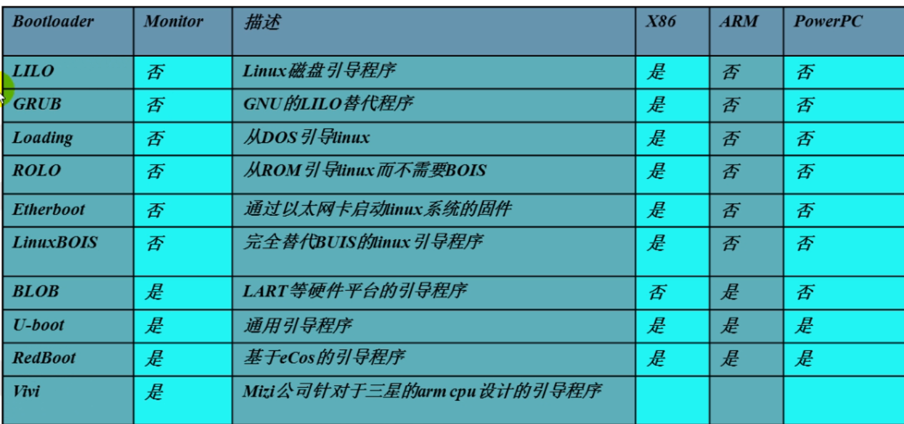

# 系统移植

- 硬件变化以后软件必须做相应调整，系统移植就是针对相应产品定位进行定制，定制包括软件及硬件
- 快速资源整合
- 嵌入式系统的核心是定制，根据市场需求对软硬件进行定制，实现性能的最大化
- os嵌入式系统：三层：硬件层/内核层/应用层

## 开发环境硬件基本组成

- 开发主机（host）
- 目标机（Target）
- 连接介质

## 开发板启动流程

- bootloader 初始化硬件 --- 加载Linux内核--初始化/挂载rootfs系统---加载应用

## 编译

- gcc编译的是x86,板子需要安装交叉编译工具tooltrain
- 通过export修改编译路径

# bootloader移植

- bootloader是硬件启动的引导程序，是运行操作系统的前提
- 操作系统内核或用户应用程序运行之前的小段代码，对软硬件进行相应的初始化和设定，为最终运行操作系统准备好环境
- 在嵌入式系统中，整个系统的启动加载任务通常由bootloader来完成

## 特点

- 不属于操作系统，采用汇编和C语言开发，针对特定的硬件平台编写
- 在移植系统时首先为开发板移植bootloader;
- bootloader不但依赖于CPU的体系结构，而且依赖于嵌入式系统板级设备的配置

## 操作模式

- 自启动模式：没有用户介入
- 交互模式：目标机上的bootloader将通过串口或网络等通信方式从开发主机上下载内核映像和根文件系统映像到RAM中，可以通过串口接收用户命令或直接进行系统的引导

## 常用bootloader

- 最常见为Uboot

## uboot命令

- 命令分类
  - 环境设置
    - printenv 显示所有环境变量
    - setenv 设置新的环境变量；内存一掉电就无效
    - saveenv 掉电保存
    - 
  - 数据传输
    - tftp 通过网络下载程序
  - 存储器访问
  - 加载运行
- 