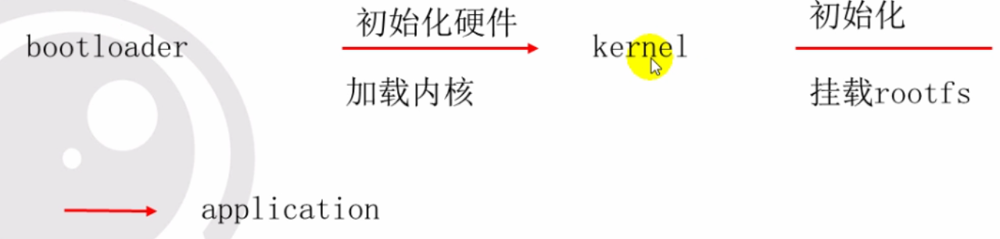
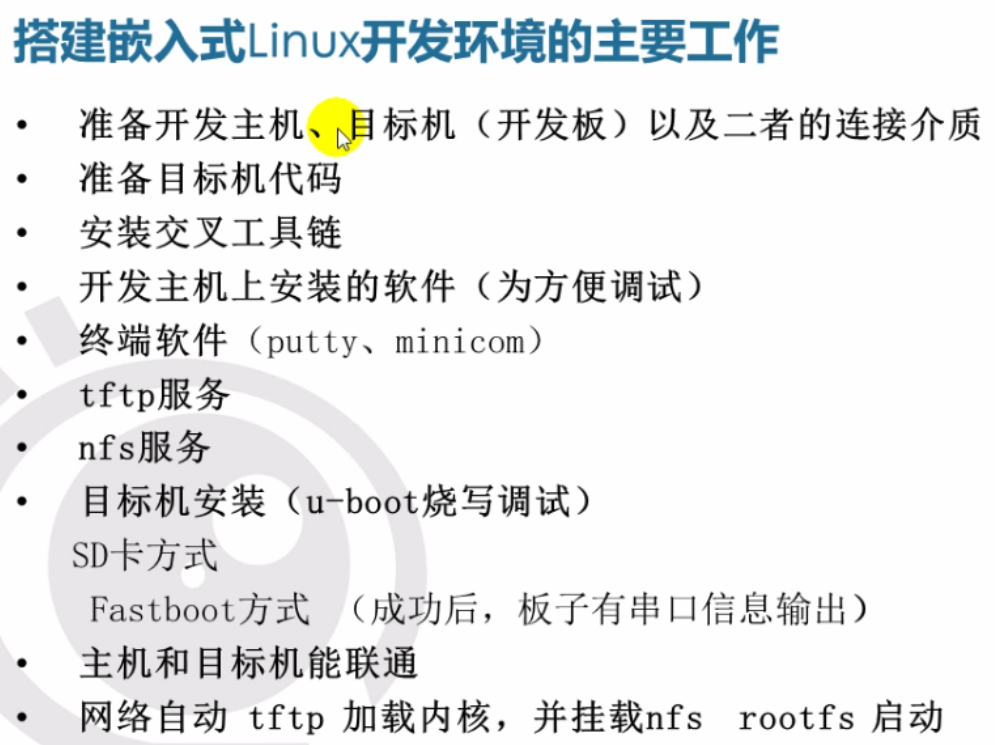

# 系统移植

- 硬件变化以后软件必须做相应调整，系统移植就是针对相应产品定位进行定制，定制包括软件及硬件
- 快速资源整合
- 嵌入式系统的核心是定制，根据市场需求对软硬件进行定制，实现性能的最大化
- os嵌入式系统：三层：硬件层/内核层/应用层

## 开发环境硬件基本组成

- 开发主机（host）
- 目标机（Target）
- 连接介质

## 开发板启动流程

- bootloader 初始化硬件 --- 加载Linux内核--初始化/挂载rootfs系统---加载应用

## 编译

- gcc编译的是x86,板子需要安装交叉编译工具tooltrain
- 通过export修改编译路径