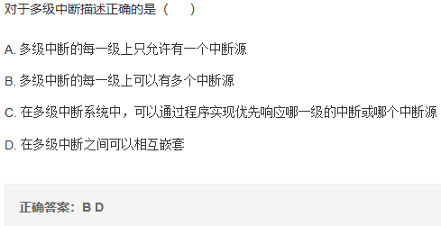
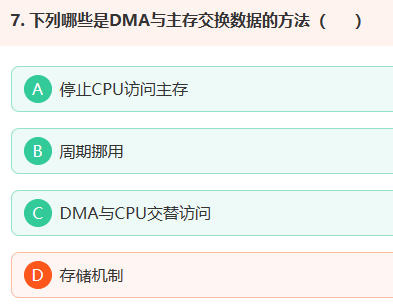
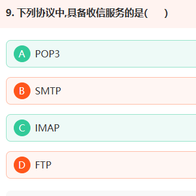
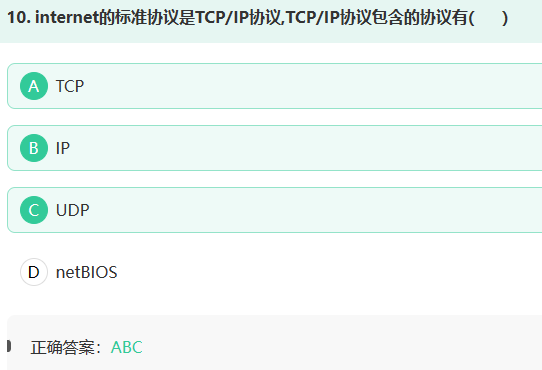
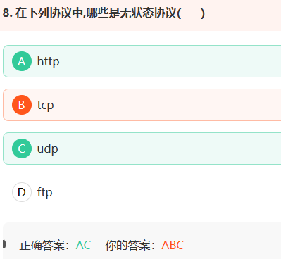
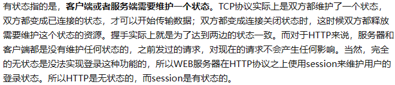
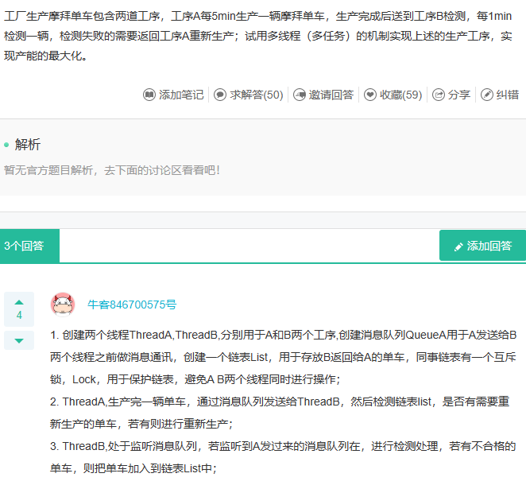

1. [ARM的六大类指令集---LDR、LDRB、LDRH、LDM、STR、STRB、STRH、STM_BOOK0614的博客-CSDN博客](https://blog.csdn.net/u013477200/article/details/50723555)
2. LDO是用于电源电路[电子电路学习笔记（14）——LDO(低压差线性稳压器)_Leung_ManWah的博客-CSDN博客](https://blog.csdn.net/qq_36347513/article/details/121019508)
3. 处理器进入异常服务时，处理状态变为处理模式，堆栈切换为MSP[Cortex-M3 双堆栈指针（MSP&PSP） - uTank - 博客园 (cnblogs.com)](https://www.cnblogs.com/utank/p/11264175.html)
4. Cortex-M4有16个32位寄存器
5. 外设读取固定数目数据时，CPU耗时最少的操作是DMA+中断
6. 程序中变量的初值保存在RW区[堆栈、BSS段、代码段、数据段、RO、RW、ZI等概念区分_代码段和只读数据区_zhy557的博客-CSDN博客](https://blog.csdn.net/zhy557/article/details/80832268)
7. 

[程序计数器（PC ） 详解_八五哥的博客-CSDN博客](https://blog.csdn.net/u012780337/article/details/105342122)

8. LTE CAT1为全双工[Cat.1、Cat.4、4G之间的区别_cat1_SummerGao.的博客-CSDN博客](https://blog.csdn.net/qq_25231683/article/details/120018672)

9. CM4异常返回时不能使用MOV指令

10. CM4进行压栈的具体操作为SP减4，[SP]保存数据

11. 射频接口电路的设计中要确保传输线的特性阻抗是50Ω

12. CM4处理的异常编号n，相应的异常向量保存在偏移地址为4n的字空间

13. CM4是32位RISC处理器[浅谈RISC CPU（精简指令集处理器）_采用精简指令集的处理器_平凡而伟大(百阅生活)的博客-CSDN博客](https://blog.csdn.net/forcj/article/details/109256657)

14. 

15. 

16. STM32F4有7个时钟产生电路，包括内部的低速和高速RC时钟振荡电路，外部的低速和高速晶体时钟振荡电路，锁相环振荡电路

17. 启动代码保存在ROM

18. 

19. 消息队列遥测传输协议（MQTT）是一种受限应用协议[MQTT协议，终于有人讲清楚了 - 知乎 (zhihu.com)](https://zhuanlan.zhihu.com/p/421109780)

20. 

21. 最低优先级默认分配给空闲线程使用，一般用户不使用

22. [对齐与非对齐访问_tyustli的博客-CSDN博客](https://blog.csdn.net/tyustli/article/details/129051914)

23. 异常事件主要有数据运算出错，非法地址访问，无效指令

24. 常规的微处理器系统由MPU、系统总线、存储器、中断控制器、直接存储访问控制器、输入输出设备组成

25. DMAC可以实现存储器至存储器、外设至存储器之间的传输

26. 外部设备主要实现数据获取、传输、显示功能

27. CM4采用MVIC和SCB来控制和管理异常源

28. 

29. 微处理器支持的指令通常由传输、运算、转移、特殊

30. 抢占式系统线程在不使用CPU时需要让出CPU的使用权让其它线程得以运行，可以使用线程延时函数和线程睡眠函数来实现此项功能

31. 定时设备中的时基单元由计数器，自动装载寄存器和预分频器组成

32. 程序设计中的判定条件是通过分析APSR和xPSR寄存器相关位实现

33. EMC是指设备或系统在其电磁环境中符合要求运行并不对其环境中的任何设备产生无法忍受的电磁干扰的能力

34. 冯诺依曼结构将指令和数据公用一个总线接口单元，只能串行共享访问存储器

35. 跳转语句会使操作流水线中断

36. 函数内部局部变量保存在堆栈中

37. CM4最多支持255个中断

38. 硬件定时器精度一般很高，可以达到纳秒级别，中断触发方式

39. 中断系统有中断请求信号检测电路和中断控制器组成

40. 对于数码管两种驱动方式中驱动功率小，所需IO数量最少的方式是动态驱动

41. I2C总线接收方非应答通过在SCL高电平，SDA高电平实现

42. STM32使用通用寄存器R0访问存储器的寻址方式是间接寻址

43. 开漏输出和推挽输出的区别：

    - 开漏输出只能输出低电平，如果要输出高电平只能通过上拉电阻实现，类似于三极管的集电极输出
    - 推挽输出既可以输出低电平，也可以输出高电平，可以注解驱动功耗不大的数字器件，导通损耗小效率高，提高电路负载能力的同时提高开关速度

44. 单片机里定时器作用和优势

    1. 作用：定时和计数；输入捕获，输出比较
    2. 优势：不需要CPU参与，精确

45. 奈奎斯特采样定理是指采样频率必须高于被采样频率的两倍，工程上一般是5倍；FFT频谱分辨率等于fs(采样频率)/N（采样点数）

46. 同步通信和异步通信的区别

    - 同步通信需要通信双方的时钟频率严格同步，逐字符发送接收，发一个收一个，需要一根时钟线，速度快，数据量小，系统搭建复杂，适用于一对多
    - 异步通信可以不要时钟线，系统简单，由于缺少定位数据的时钟线，必须在传输数据帧前后加上开始结束等冗余字符，用于点对点
    - 同步通信比异步通信效率高

47. 简述通过I2C接口读取设备X的寄存器Y的值的过程

    1.首先SDA拉低，然后SCL拉低，表示传输开始。
    2.接着SDA发送7bit位（针对7位模式）的从机（设备x)地址，一个读写标志位。从机收到信号决定是否发回应答信号ACK。
    3.接着i2c接口会发送从机寄存器的地址（8bit)位，从机收到信号决定是否发回应答信号ACK,发回为1，默认为0。
    4.重复第一步的开始信号。
    5.SDA再一次发送从机地址，此时读写标志位为1，然后是一个ACK信号。
    6.紧接着就是读取寄存器Y的值了，这是一个8位的数据，由从机发出的。
    7.最后就是从机返回一个NACK信号。表示信号传输结束。将SDA拉高,scl拉高。

48. 中断是什么》简述中断处理过程
    - CPU在正常执行程序的过程中，由于内部/外部事件的触发或程序的预先安排引起CPU暂时中断当前正在运行的程序，而转去执行中断服务子程序，待中断服务子程序执行完毕后，CPU继续执行原来的程序，这一过程称为中断；
    - 中断处理的过程：
              第一步：保护现场，将当前位置的PC地址压栈；
              第二步：跳转到中断服务程序，执行中断服务程序；
              第三步：恢复现场，将栈顶的值回送给PC；
              第四步：跳转到被中断的位置开始执行下一个指令；
    - 中断请求--中断响应--保护现场--中断服务--恢复现场--中断返回
49. 相比于正常子函数，中断服务函数无参，无返回值，不能使用延时函数等耗时操作，不可递归调用
50. 
51. 
52. 

53. 
54. 
55. 

56. 电阻选型主要从阻值选用、 误差选用、电阻器的极限参数、功耗、封装等方面选用 

57. 信号输出的准度和分辨率并不完全等同，但它们之间有一定的关联。分辨率是指模数转换器（ADC）或数模转换器（DAC）能够分辨的最小电压或电流变化量，通常以比特（bit）为单位表示。例如，一个12位ADC的分辨率为2^12=4096，即它可以将输入电压分成4096个离散的量化级别。 而信号输出的准度则是指ADC或DAC输出的数字信号与实际输入信号之间的误差。这个误差通常由两个参数来描述：INL（Integral Nonlinearity）和DNL（Differential Nonlinearity）。 INL是指ADC或DAC输出的数字信号与理论值之间的积分非线性误差，通常以LSB（Least Significant Bit）为单位表示。例如，一个12位ADC的INL为±1 LSB，则表示它的输出数字信号与实际输入信号之间的误差不超过1个LSB。 DNL是指相邻量化级之间的差值与理论值之间的差异，通常也以LSB为单位表示。例如，一个12位ADC的DNL为±0.5 LSB，则表示相邻量化级之间的差值与理论值之间的误差不超过0.5个LSB。 理解INL和DNL的关键在于理解它们描述的是ADC或DAC输出数字信号与实际输入信号之间的误差。INL描述的是整个输入范围内的积分误差，而DNL描述的是相邻量化级之间的差异误差。因此，INL和DNL越小，ADC或DAC输出的数字信号与实际输入信号之间的误差就越小，输出信号的准确度就越高

58. 用变量a给出以下定义：

    一个指向指针的指针，它指向的指针是指向一个整型数  int \**a

    一个有10个指针的数组，该指针是指向一个整型数的 int \*a[10]

    一个指向有10个整型数数组的指针 int (\*a)[10]

59. SPI:全双工通信 四根线 SDI SDO SCK CS 以CS选择从机

    I2C 半双工 SCL和SDA

    UART 全双工 RX TX 以地址选择从机

60. 试描述TCP建立和断开连接时的三次握手和四次挥手

    - 三次握手：
      1.客户端先发送标志位SYN=1，seq=x请求与服务器建立连接
      2.服务器收到客户端的TCP报文后，返回标志位SYN=1，ACK=1，seq=y，ack=x+1的报文应答客户端并同意建议连接
      3.客户端收到服务器的TCP报文后，返回标志位ACK=1，seq=x+1，ack=y+1的报文表示接收到服务器的消息并建立连接

    - 四次挥手：
      1.客户端向服务器发送标志位FIN=1，seq=x的报文请求断开连接
      2.服务器收到后，返回标志位ACK=1，seq=y，ack=x+1的报文告诉客户端收到报文，并准备断开连接
      3.服务器做好断开连接的准备后，给客户端发送标志位FIN=1，ACK=1，seq=u，ack=x+1的报文告诉客户端已做好准备断开连接
      4.客户端收到报文后，返回标志位ACK=1，seq=x+1，ack=u+1的报文表示收到消息并断开连接

61. 

62. 运算放大器有两种工作模式：引入负反馈的线性模式和正反馈的非线性模式；

    “虚短”是放大器的输入端正负电极电位相同，近似于短路状态

    “虚断”是输入端正负极之间没有电流通过，近似于断开状态

63. RAW型依赖关系（read after write）:写后读
64. 乱序执行（out-of-order execution）是指CPU采用了允许将多条指令不按程序规定的顺序分开发送给各相应电路单元处理的技术；在指令执行阶段是乱序执行的
65. 程序的局部变量存在于栈中，全局变量存在于静态区中，动态申请数据存在于堆中，变量放在堆区与栈区的区别是从申请方式，申请大小，申请效率简单比较：Stack的空间由操作系统自动分配/释放，Heap上的空间手动分配/释放。Stack空间有限，Heap是很大的自由存储区。Stack申请效率高，Heap申请效率低。
66. 
