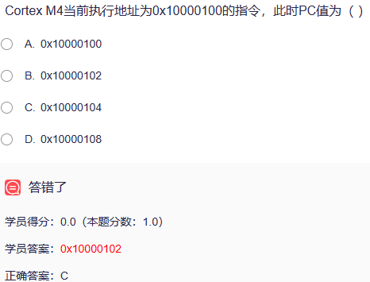
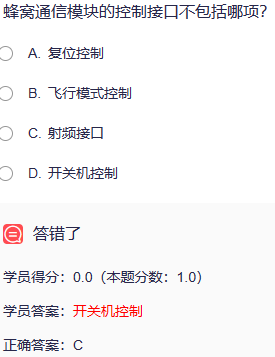
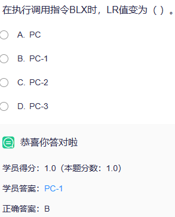
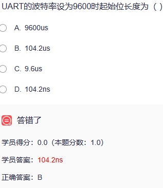
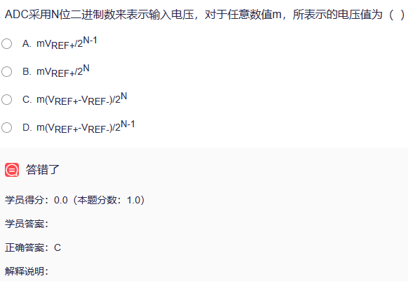
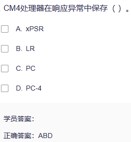

1. [ARM的六大类指令集---LDR、LDRB、LDRH、LDM、STR、STRB、STRH、STM_BOOK0614的博客-CSDN博客](https://blog.csdn.net/u013477200/article/details/50723555)
2. LDO是用于电源电路[电子电路学习笔记（14）——LDO(低压差线性稳压器)_Leung_ManWah的博客-CSDN博客](https://blog.csdn.net/qq_36347513/article/details/121019508)
3. 处理器进入异常服务时，处理状态变为处理模式，堆栈切换为MSP[Cortex-M3 双堆栈指针（MSP&PSP） - uTank - 博客园 (cnblogs.com)](https://www.cnblogs.com/utank/p/11264175.html)
4. Cortex-M4有16个32位寄存器
5. 外设读取固定数目数据时，CPU耗时最少的操作是DMA+中断
6. 程序中变量的初值保存在RW区[堆栈、BSS段、代码段、数据段、RO、RW、ZI等概念区分_代码段和只读数据区_zhy557的博客-CSDN博客](https://blog.csdn.net/zhy557/article/details/80832268)
7. 

[程序计数器（PC ） 详解_八五哥的博客-CSDN博客](https://blog.csdn.net/u012780337/article/details/105342122)

8. LTE CAT1为全双工[Cat.1、Cat.4、4G之间的区别_cat1_SummerGao.的博客-CSDN博客](https://blog.csdn.net/qq_25231683/article/details/120018672)
9. CM4异常返回时不能使用MOV指令
10. CM4进行压栈的具体操作为SP减4，[SP]保存数据
11. 射频接口电路的设计中要确保传输线的特性阻抗是50Ω
12. CM4处理的异常编号n，相应的异常向量保存在偏移地址为4n的字空间
13. CM4是32位RISC处理器[浅谈RISC CPU（精简指令集处理器）_采用精简指令集的处理器_平凡而伟大(百阅生活)的博客-CSDN博客](https://blog.csdn.net/forcj/article/details/109256657)
14. 
15. 
16. STM32F4有7个时钟产生电路，包括内部的低速和高速RC时钟振荡电路，外部的低速和高速晶体时钟振荡电路，锁相环振荡电路
17. 启动代码保存在ROM
18. 
19. 消息队列遥测传输协议（MQTT）是一种受限应用协议[MQTT协议，终于有人讲清楚了 - 知乎 (zhihu.com)](https://zhuanlan.zhihu.com/p/421109780)
20. 

21. 最低优先级默认分配给空闲线程使用，一般用户不使用
22. [对齐与非对齐访问_tyustli的博客-CSDN博客](https://blog.csdn.net/tyustli/article/details/129051914)
23. 异常事件主要有数据运算出错，非法地址访问，无效指令
24. 常规的微处理器系统由MPU、系统总线、存储器、中断控制器、直接存储访问控制器、输入输出设备组成
25. DMAC可以实现存储器至存储器、外设至存储器之间的传输
26. 外部设备主要实现数据获取、传输、显示功能
27. CM4采用MVIC和SCB来控制和管理异常源
28. 
29. 微处理器支持的指令通常由传输、运算、转移、特殊
30. 抢占式系统线程在不使用CPU时需要让出CPU的使用权让其它线程得以运行，可以使用线程延时函数和线程睡眠函数来实现此项功能
31. 定时设备中的时基单元由计数器，自动装载寄存器和预分频器组成
32. 程序设计中的判定条件是通过分析APSR和xPSR寄存器相关位实现
33. EMC是指设备或系统在其电磁环境中符合要求运行并不对其环境中的任何设备产生无法忍受的电磁干扰的能力
34. 冯诺依曼结构将指令和数据公用一个总线接口单元，只能串行共享访问存储器
35. 跳转语句会使操作流水线中断
36. 函数内部局部变量保存在堆栈中
37. CM4最多支持255个中断
38. 硬件定时器精度一般很高，可以达到纳秒级别，中断触发方式
39. 中断系统有中断请求信号检测电路和中断控制器组成
40. 对于数码管两种驱动方式中驱动功率小，所需IO数量最少的方式是动态驱动
41. I2C总线接收方非应答通过在SCL高电平，SDA高电平实现
42. STM32使用通用寄存器R0访问存储器的寻址方式是间接寻址