# 基本概念

- 串行和并行：并行是一次可以多位数据，串行一次只能传输一位数据，只有一根数据线（实际工程中串行较多）

- 单工通信和双工通信

  - 单工：只能单向

    

  - 双工：能双向通信

    - 半双工：不能同时发送和接收

      

    - 全双工：能同时发送和接收

      

- 波特率：用于描述uart通信时的通信速度，单位为bps,即每秒钟传送的bit的数量

- 异步和同步：异步收发双方时钟不一样

- 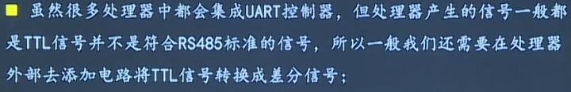

  

# UART

- 通用异步收发器
- 串行，异步通信总线
- 有两条数据线，可以实现全双工（同时发送接收）的发送和接收
- 常用于主机与辅助设备之间的通信

## UART帧格式

- 数据位一般为8位
- 校验位检验数据的正确性，校验位只能校验错误，不能修正错误，校验位可有可无，有校验位后速率会变慢
- 停止位可以有1/1.5/2位，必须要是高电平
- 串口不能连续发送字节是为了防止出现累积误差

# RS232/RS485

## RS232

- RS232是用于串行通讯的标准，标准中对连接器的每个引脚加以规定，并对电平做出规定

- 依赖于串口，在软件编程上没有任何区别

- 一般用简化后的接口（9根线），目前一般只使用RXD，TXD和GND三根线

- 串口存在的问题

  - 电气接口不统一

    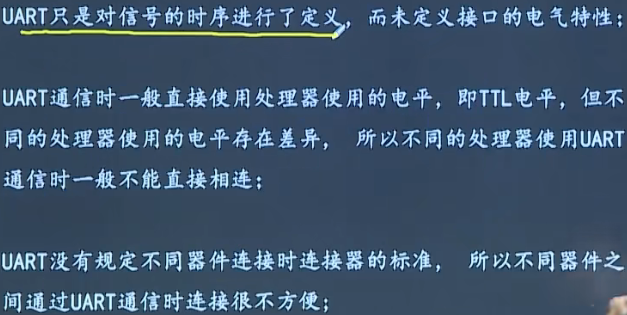

    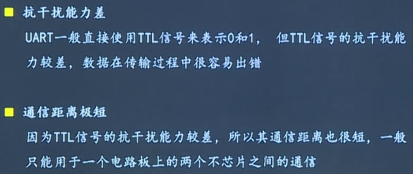

- 该标准规定逻辑1电平为-5~-15V，逻辑0的电平为+5V到+15V，选用该电气标准的目的在于提高抗干扰能力，增大通信距离，其传输距离可达15M

## RS232存在的问题

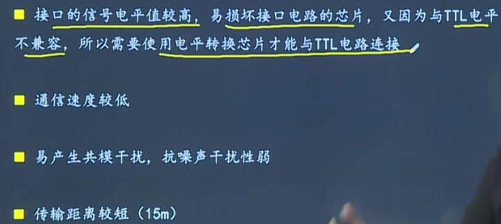

## RS485

- 该标准能在远距离条件下以及电子噪声大的环境下有效传输信号；该标准能连接多个收发器，具有多站能力，可以利用单一的RS485接口方便的建立起一个设备网络
- RS485利用差分信号（电压差）进行数据传输，半双工
- 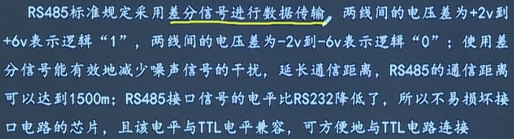

- 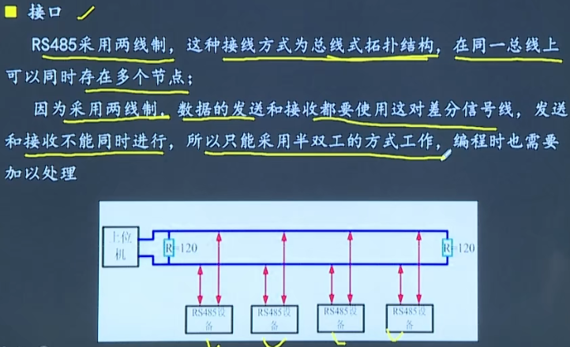

# I2C

- 串行，半双工
- 用于近距离，低速芯片之间通信
- SDA收发数据，SCL用于双方时钟同步
- 多主机总线，连接在总线上的器件分为主机和从机，主机有权发起和结束一次通信，从机只能被主机呼叫
- 当总线上有多个主机同时启用总线时，总线具备冲突检测和仲裁功能来防止错误的发生
- 每个连接到总线上的器件都有一个唯一的地址，每个主机可以作为从机，同一时刻只能有一个主机，总线上的设备的增加和删除不影响其它器件正常工作
- 发送数据的器件为发送器，接收数据的器件为接收器

## 通信过程

- I2C第一个字节一定是主机给从机，后续字节由第一个字节最后一位决定
- 起始信号和停止信号一定是主机发送
- 

## 信号

- 先发送高位

  

- 

## 典型时序

- 第三种情况中中间没有停止信号，防止总线使用权被抢走

#  SPI总线

- 串行外设接口
- 一种高速、串行、全双工、同步通信接口
- 采用主从工作方式，有一个主设备和多个从设备
- SPI至少需要四根线
  - MISO--主设备输入从设备输出
  - MOSI--主设备输出从设备输入
  - SCLK--时钟
  - CS--片选
- 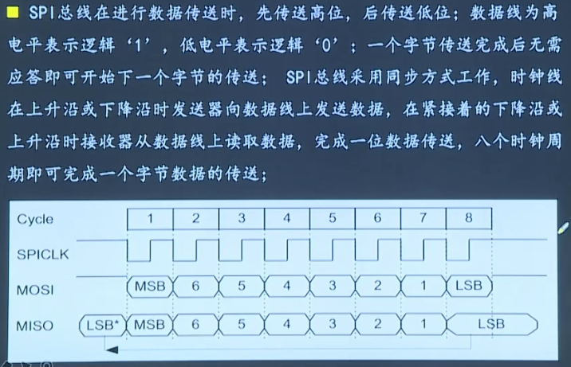

- 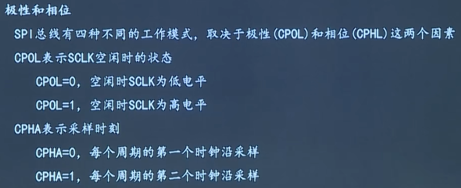

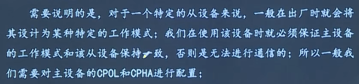

# CAN总线

## 协议11898

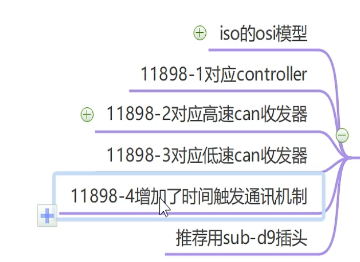

## 边界条件

- 长度最长40m
- 速率1Mbit/s
- 网络末端要有终端电阻，防止信号反射
- 不超过32个节点，取决于收发器的驱动能力

## 物理构成

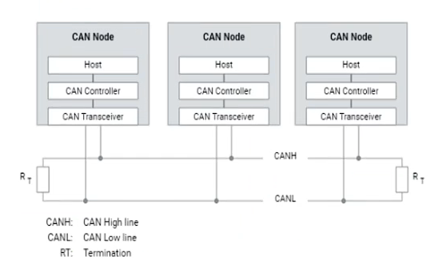

- controler:通常与MCU整合到一起

- transver

  - 低速can收发器

    - 0~125K速率，不需要终端电阻来阻止反射

    - 差分电平

      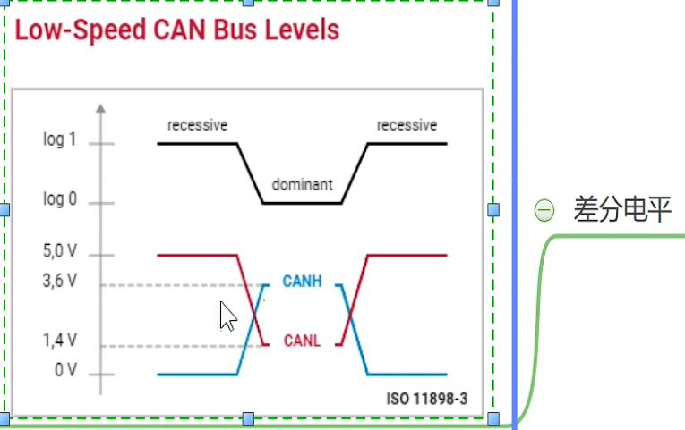

  - 高速can收发器
    - 0~1Mbit/s,需要120Ω终端电阻
    - 差分电平
      - 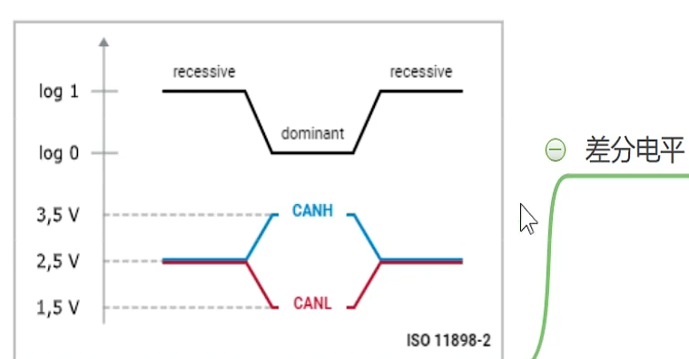

- 总线逻辑
  - 逻辑1是隐形，逻辑0是显性
  - 多点同时发送是遵循线与逻辑

## 通讯

- 去中心化，分布式原则
  - 总线空闲时任意节点均可竞争发消息
  - 消息将被广播，由节点自己决定是否过滤
- 事件驱动（类似单片机中断）
- 通信矩阵

## 帧格式

### 数据帧

- 用于主动传输数据

- 格式

  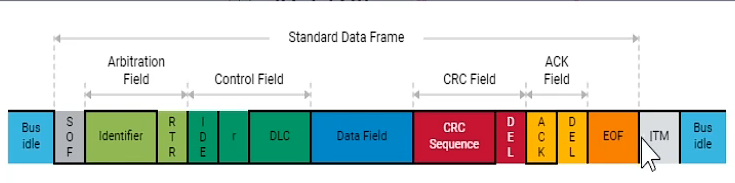

  - sof:发出一个显性位边沿，网络节点以此开始同步
  - id:11位，定义消息的优先级/总线金证力，数字越低优先级越高
  - RTR：显性表示数据帧，隐性表示远程帧
  - r：保留位
  - DLC：表示数据场（data field）字节chang'du

### 远程帧

### 错误帧