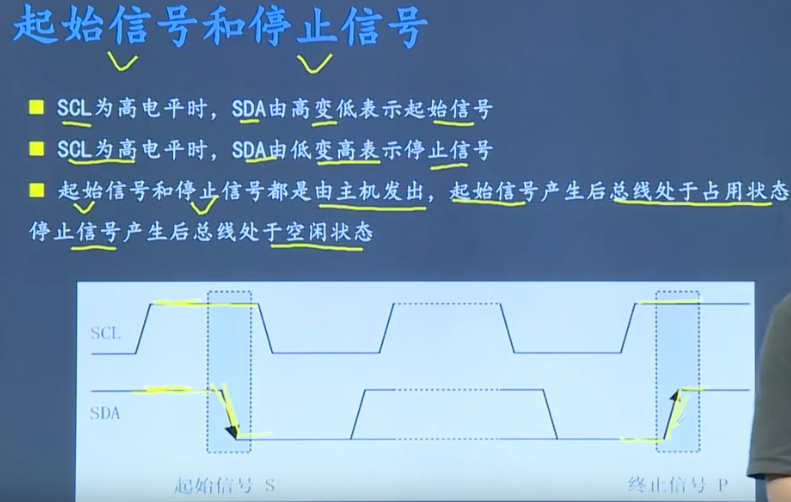

# 基本概念

- 串行和并行：并行是一次可以多位数据，串行一次只能传输一位数据，只有一根数据线（实际工程中串行较多）

- 单工通信和双工通信

  - 单工：只能单向

    

  - 双工：能双向通信

    - 半双工：不能同时发送和接收

      

    - 全双工：能同时发送和接收

      

- 波特率：用于描述uart通信时的通信速度，单位为bps,即每秒钟传送的bit的数量

- 异步和同步：异步收发双方时钟不一样

  

# UART

- 通用异步收发器
- 串行，异步通信总线
- 有两条数据线，可以实现全双工（同时发送接收）的发送和接收
- 常用于主机与辅助设备之间的通信

## UART帧格式

- 数据位一般为8位
- 校验位检验数据的正确性，校验位只能校验错误，不能修正错误，校验位可有可无，有校验位后速率会变慢
- 停止位可以有1/1.5/2位，必须要是高电平
- 串口不能连续发送字节是为了防止出现累积误差

# I2C

- 串行，半双工
- 用于近距离，低速芯片之间通信
- SDA收发数据，SCL用于双方时钟同步
- 多主机总线，连接在总线上的器件分为主机和从机，主机有权发起和结束一次通信，从机只能被主机呼叫
- 当总线上有多个主机同时启用总线时，总线具备冲突检测和仲裁功能来防止错误的发生
- 每个连接到总线上的器件都有一个唯一的地址，每个主机可以作为从机，同一时刻只能有一个主机，总线上的设备的增加和删除不影响其它器件正常工作
- 发送数据的器件为发送器，接收数据的器件为接收器

## 通信过程

- I2C第一个字节一定是主机给从机，后续字节由第一个字节最后一位决定
- 起始信号和停止信号一定是主机发送
- 

## 信号

- 先发送高位

  

- 

## 典型时序

- 第三种情况中中间没有停止信号，防止总线使用权被抢走

# RS232/RS485