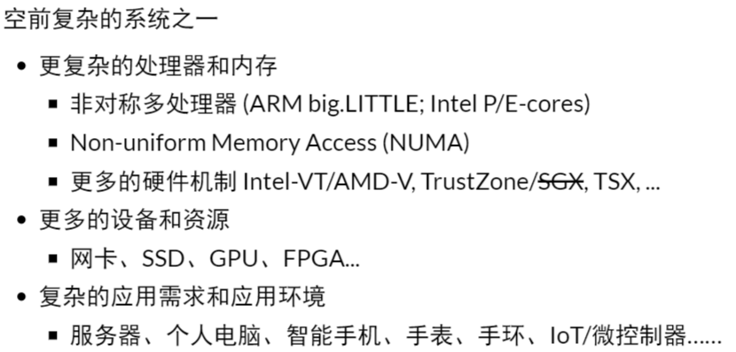

# 概述

- 操作系统初始概念：

  - 管理多个程序依次排队运行的库函数和调度器
    - 操作(operate)任务(jobs)的系统(system)
    - 多用户排队共享计算机
    - 操作系统中出现设备，文件，任务等对象和api
  - 集成电路的出现--更快的cpu/完善的中断/异常机制
  - 同时将多个程序载入内存
    - 有了进程的概念
    - 在多个地址空间隔离的程序之间切换
    - 虚拟存储使得一个程序出bug不会crash整个系统
    - 增加进程管理api
  - 分时系走向成熟，unix诞生并走向完善，奠定现代操作系统的形态

- 今天的操作系统：通过虚拟化硬件资源为程序运行提供服务的软件

  

- 