# 面试题

- 

- 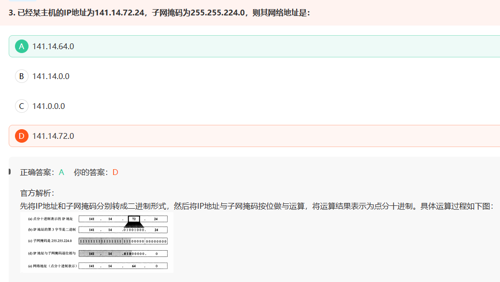

- 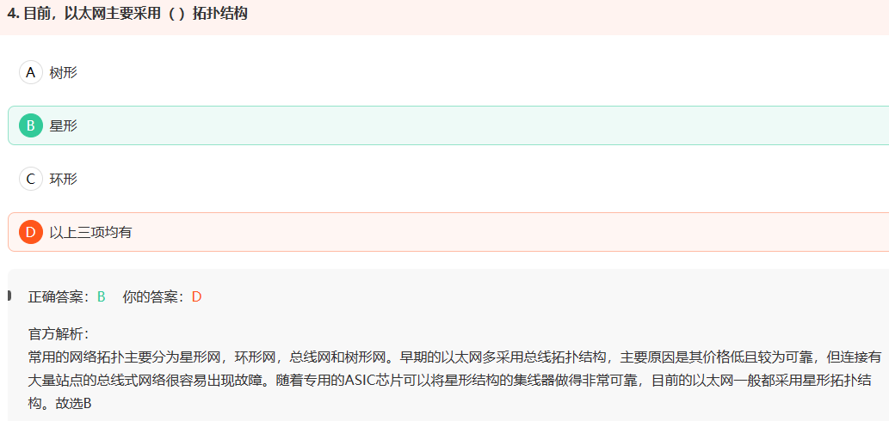

- 

- 

- 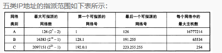

- 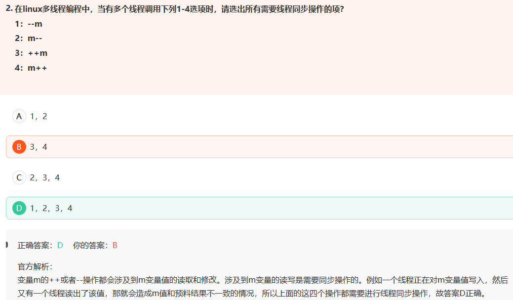

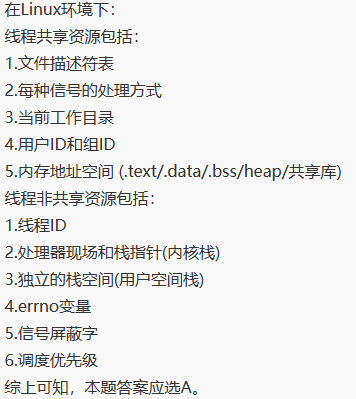

- 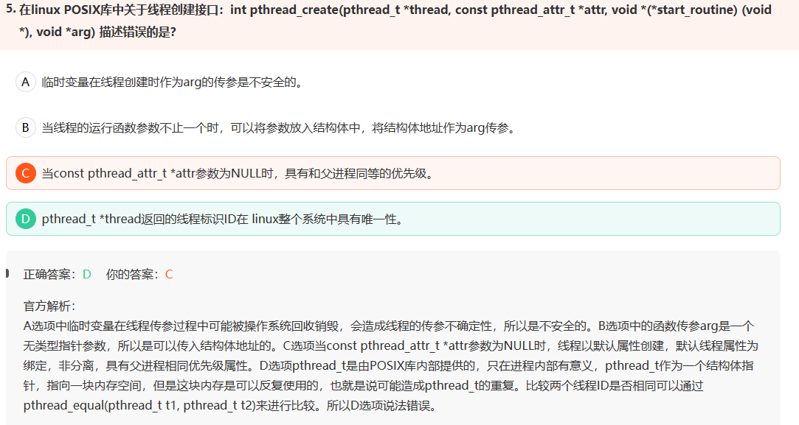

- 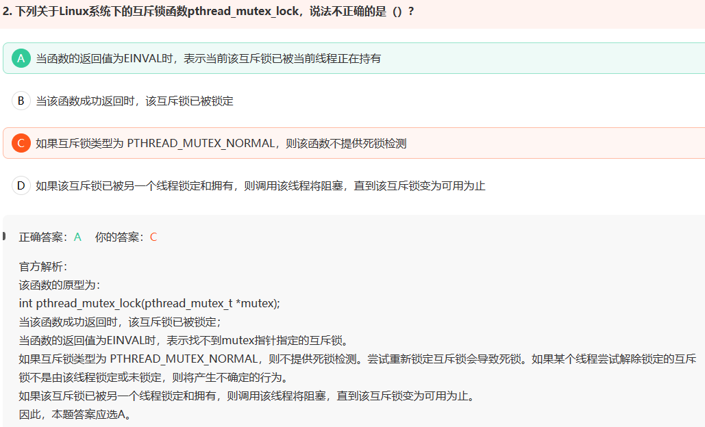

- 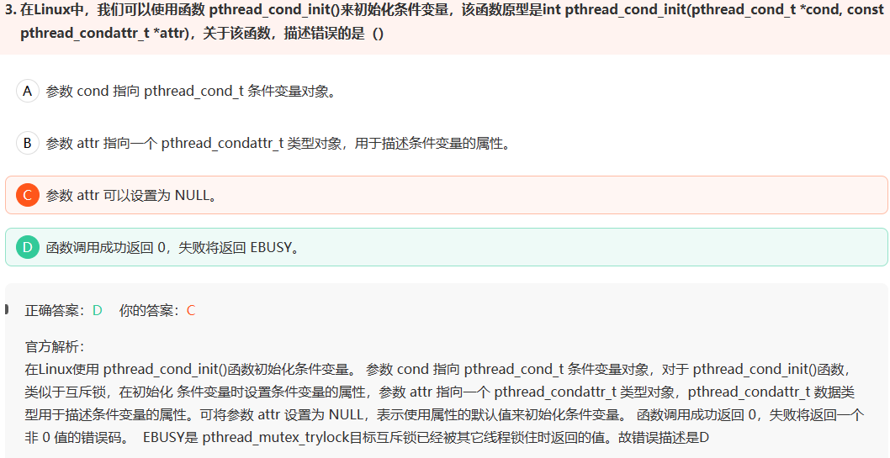

- 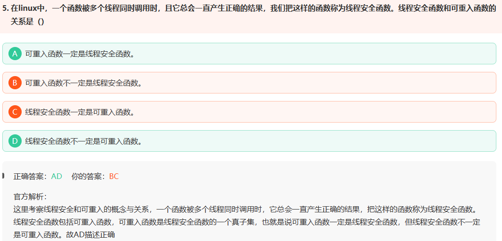

- 

- 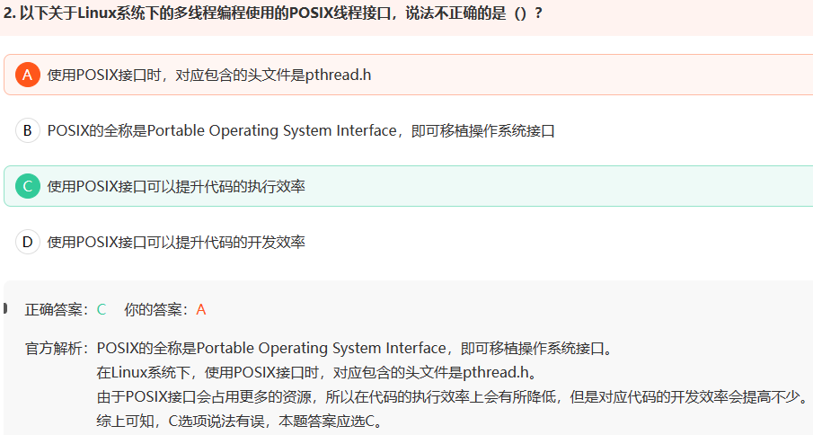

- 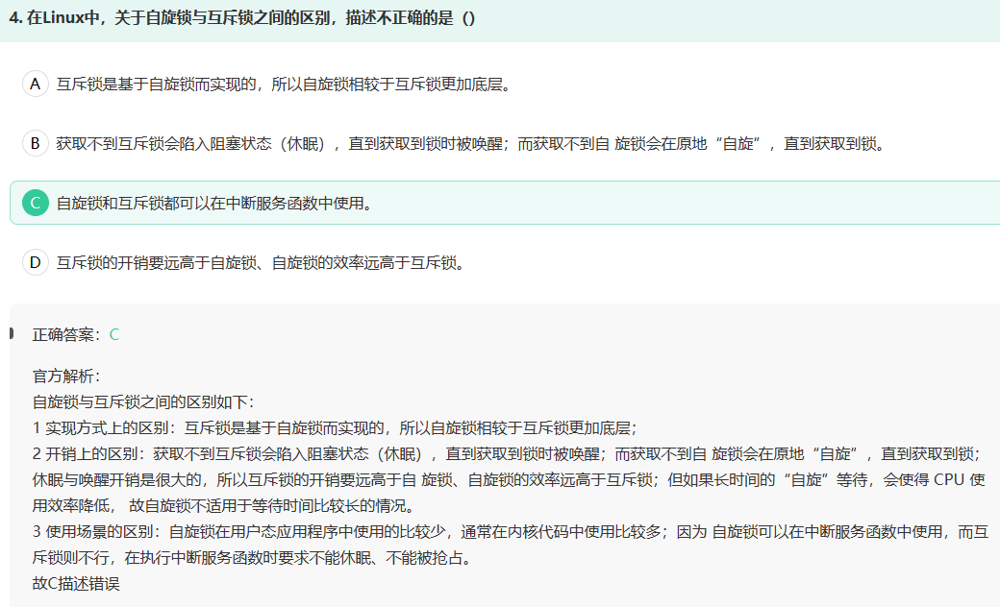

- 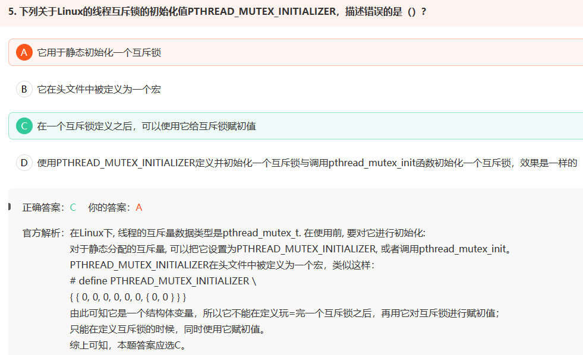

- 用户态访问内核态资源的方式：
  - 系统调用
  - 库函数
  - shell脚本
- 用户态到内核态切换方式
  - 系统调用（本身为中断，软中断）
  - 异常
  - 外设中断
  - [Linux常问面试问题之——用户态与内核态、用户态访问内核态资源的方式、用户态到内核态的切换_用户态内核态_JMW1407的博客-CSDN博客](https://blog.csdn.net/JMW1407/article/details/107901155#:~:text=4、用户态到内核态怎样切换？ 1 Linux操作系统中主要采用了 0和3两个特权级 ，分别对应的就是 内核态 和 用户态,()系统调用来分配内存，当malloc调用sbrk ()的时候就涉及一次从用户态到内核态的切换， 类似的函数还有printf ()，调用的是wirte ()系统调用来输出字符串，等等。 U ——user（用户）%2C K——kernal（内核）)

- C++编译器至少对一个类添加四个函数：
  - 默认构造函数
  - 默认析构函数
  - 默认拷贝构造函数
  - 赋值运算符operator=
- string本质是一个类，char \* 是一个指针